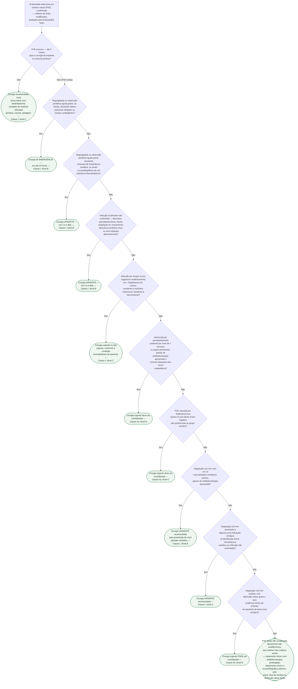

# Fluxograma: Endocardite Infecciosa em Prótese Valvar — Indicação e Timing de Cirurgia (ESC 2023)

A endocardite infecciosa em prótese valvar (PVE, do inglês *prosthetic
valve endocarditis*) é a forma mais grave de endocardite infecciosa,
respondendo por 20 a 30% de todos os casos e com mortalidade
hospitalar de 20 a 40%. A decisão entre tratamento clínico e cirurgia —
e, quando cirúrgica, o *timing* dessa cirurgia — é o determinante mais
importante do prognóstico: nos registros observacionais citados pela
diretriz, o principal fator associado a recidiva e morte é justamente
**deixar de operar apesar de uma indicação clara**. Este fluxograma
organiza essa decisão a partir das duas tabelas de recomendação da
diretriz ESC 2023 para o manejo da endocardite: a recomendação
específica para PVE precoce (Tabela 19) e as indicações gerais de
cirurgia por insuficiência cardíaca, infecção não controlada e
prevenção de embolia (Tabela 12), que se aplicam tanto à valva nativa
quanto à prótese. O ponto de partida é sempre um diagnóstico já
confirmado de PVE, com decisão tomada em conjunto pelo Heart Team/
Endocarditis Team.

## Árvore de decisão

## Notas de leitura

- **PVE precoce vs. tardia**: o corte de 6 meses após a cirurgia
  valvar não é apenas cronológico — reflete um perfil microbiológico e
  prognóstico distinto. A PVE de início peri-operatório é dominada por
  *S. aureus*, *Staphylococcus epidermidis* e micro-organismos
  nosocomiais (Gram-negativos, fungos), com alta mortalidade e resposta
  ruim a antibiótico isolado; por isso a diretriz recomenda reoperação
  já na Tabela 19, independentemente dos demais critérios.
- **As três famílias de indicação cirúrgica** (insuficiência cardíaca,
  infecção não controlada, prevenção de embolia) da Tabela 12 valem
  igualmente para valva nativa e protética — a única linha
  explicitamente redigida para PVE dentro dessa tabela é a de cirurgia
  por *S. aureus* ou Gram-negativo não-HACEK (D7 nesta árvore).
- **Definições de urgência** (nota de rodapé da Tabela 12): emergência
  = até 24 horas; urgente = 3 a 5 dias; não urgente = ainda na mesma
  internação.
- Este fluxograma cobre a PVE **pós-cirúrgica clássica**; a endocardite
  em prótese valvar aórtica transcateter (pós-TAVI) tem perfil de risco
  cirúrgico e taxas de reoperação bem diferentes (cirurgia realizada em
  apenas ~20% dos casos, segundo a mesma diretriz) e não está
  representada nesta árvore.
