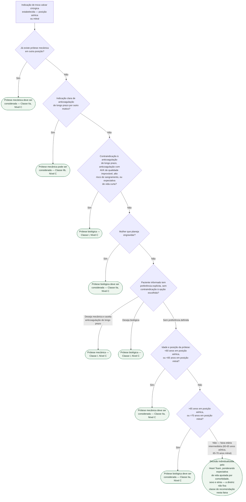

# Fluxograma: Escolha de Prótese Valvar — Mecânica versus Biológica, por Idade e Comorbidade (ESC/EACTS 2025)

A escolha entre prótese mecânica e biológica não é uma equação só de idade. A
diretriz ESC/EACTS 2025 pondera, na ordem que este fluxograma reproduz: uso
prévio de anticoagulante por outro motivo, contraindicação à anticoagulação de
longo prazo, planejamento de gestação, e só então — na ausência de qualquer um
desses e sem preferência clara do paciente informado — o corte etário por
posição da valva. Tratar a decisão só pela idade cronológica é o erro mais
comum, e a própria diretriz coloca a preferência do paciente informado no mesmo
nível de recomendação (Classe I) que os cortes etários.

## Árvore de decisão

## Por que a preferência do paciente vem antes do corte etário

As duas recomendações de Classe I mais fortes da tabela não são cortes
numéricos — são "segundo o desejo do paciente informado", tanto para mecânica
quanto para biológica. O corte etário (nós D5/D6) só decide quando **não há**
contraindicação, planejamento gestacional, nem preferência clara já
manifestada. Isso inverte a ordem que a prática costuma seguir — decidir pela
idade e informar o paciente depois — e é deliberado: a diretriz reconhece que a
melhor prótese é a que o paciente aceita conviver, com anticoagulação de longo
prazo ou com o risco de reoperação futura.

## Por que existe uma faixa etária sem recomendação de classe

Entre 60 e 65 anos em posição aórtica (e entre 65 e 70 em posição mitral), a
diretriz simplesmente não atribui Classe I/IIa a nenhuma das duas próteses — a
tabela de recomendação salta do corte "<60/<65" para o corte ">65/>70". Nessa
faixa a decisão depende mais de expectativa de vida ajustada por comorbidade,
sexo e etnia (que costuma alterar a idade "biológica" efetiva) do que de um
número isolado, e por isso a árvore não inventa um corte que a fonte não dá —
registra a lacuna como decisão do Heart Team.

Já portar prótese mecânica em outra posição não é equivalente a apenas ter uma
indicação independente de anticoagulação crônica. A ESC/EACTS 2025 atribui
**IIa/C** ao primeiro cenário e **IIb/C** ao segundo; por isso eles aparecem em
nós separados, sem reduzir indevidamente a força da primeira recomendação.

## O que a árvore não mostra

- **O alvo de INR por tipo e posição da prótese mecânica não está aqui** — vale
  de 2 a 4 conforme a combinação de fator pró-trombótico adicional, tipo de
  prótese e posição, e está detalhado na Tabela 10 do documento
  `protese-valvar-escolha-mecanica-vs-biologica-e-alvo-de-inr-esc-eacts-2025.md`,
  nesta mesma pasta.
- **DOAC e dupla antiagregação são formalmente contraindicados** (Classe III,
  Nível A) para prevenir trombose em qualquer prótese mecânica, independente do
  ramo desta árvore que levou à escolha — não é uma alternativa ao AVK a ser
  considerada em nenhum ponto do fluxograma.
- **Esta árvore não cobre a troca de prótese já implantada** — reoperação por
  disfunção de bioprótese (estrutural ou não estrutural, com a classificação
  VARC-3) e o manejo perioperatório de anticoagulação em portador de prótese
  mecânica submetido a procedimento não cardíaco têm documentos próprios nesta
  pasta e em Perioperatório.
- **A decisão continua exigindo o Heart Team e a discussão explícita do risco de
  sangramento versus risco de reoperação** — a árvore organiza os critérios da
  diretriz, mas não substitui essa conversa.
