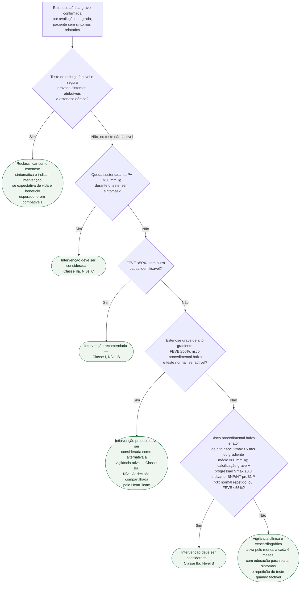

# Fluxograma: Estenose Aórtica Grave Assintomática — Quando Intervir (ESC/EACTS 2025)

A pasta já tem um fluxograma para a decisão entre TAVI e cirurgia — mas aquele
parte de uma indicação de intervenção **já estabelecida**. A pergunta clínica mais
difícil, e a que costuma ser resolvida errado, vem antes: num paciente com
estenose aórtica grave que **diz não ter sintomas**, quando a intervenção deve
ser indicada mesmo assim? Esperar o sintoma clássico aparecer tem custo — o
paciente pode chegar já com dano ventricular ou evento embólico —, mas intervir
cedo demais expõe alguém realmente assintomático ao risco de um procedimento que
poderia esperar. Este fluxograma organiza os critérios objetivos que decidem essa
fronteira.

## Árvore de decisão

## Por que o teste de esforço vem antes da fração de ejeção

Boa parte dos pacientes que se dizem "assintomáticos" na consulta apenas
reduziram a própria atividade sem perceber — é um viés comum em quem convive com
limitação progressiva. O teste ergométrico, feito sob supervisão em quem
realmente não relata sintoma espontâneo (e é **contraindicado** em quem já tem
sintoma claro), expõe esse mascaramento: sintoma limitante atribuível à
estenose reclassifica o paciente como sintomático, mesmo sem queixa espontânea,
e a conduta passa a ser a mesma da estenose sintomática. Uma
queda sustentada de pressão >20 mmHg, sem sintomas, é uma indicação distinta e
mais fraca (IIa/C), não deve ser rotulada como Classe I.

## Os critérios do nó D4, resumidos

O nó de decisão D4 reúne quatro achados que, isoladamente, cada um já sustenta a
recomendação Classe IIa/B em paciente de baixo risco procedimental — não são
bifurcações sucessivas, são entradas independentes da mesma avaliação:

- **estenose muito grave**, pelo pico de velocidade transvalvar muito acima do
  corte de gravidade padrão;
- **progressão hemodinâmica rápida** entre dois ecocardiogramas seriados;
- **BNP marcadamente elevado**, acima do esperado para idade e sexo, sem outra
  causa que explique a elevação (arritmia, disfunção renal, outra cardiopatia);
- **FEVE <55%**, sem outra explicação.

A metanálise de 4 ensaios randomizados já publicada nesta pasta
(`troca-valvar-aortica-precoce-na-estenose-aortica-assintomatica-grave-metanalise-de-4-rcts.md`)
reforça a redução de desfechos compostos, mas não autoriza afirmar benefício de
mortalidade em todos os pacientes. No EARLY TAVR, a diferença do composto foi
fortemente influenciada por hospitalização/intervenção não planejada, sem
diferença significativa isolada de mortalidade ou AVC em cinco anos.

## O que a árvore não mostra

- **Esta árvore não decide o modo de intervenção.** Uma vez indicada a
  intervenção por qualquer um dos ramos acima, a escolha entre TAVI e cirurgia
  segue o próprio fluxograma desta pasta,
  `fluxograma-estenose-aortica-decisao-de-intervencao-esc-eacts-2021.md`, que
  pondera características clínicas, anatômicas, experiência do centro e
  preferência do paciente pelo Heart Team.
- **A definição de gravidade em si não está aqui.** Os cortes que definem
  estenose aórtica grave — velocidade de pico, gradiente médio, área valvar e
  área indexada — e o problema da discordância entre esses parâmetros em 20-30%
  dos casos estão em `valvopatias-estenose-aortica-e-atualizacoes-gerais-esceacts-2021.md`,
  nesta mesma pasta.
- **Estenose de baixo fluxo e baixo gradiente exige avaliação à parte,** com
  ecocardiograma sob estresse com dobutamina ou escore de cálcio por tomografia
  para confirmar gravidade antes mesmo de entrar nesta árvore — pular essa etapa
  e aplicar o nó D2/D3 direto a um gradiente discordante é o erro mais comum
  nesse subgrupo.
- **Expectativa de vida e comorbidade não fazem parte da árvore**, mas continuam
  pesando na decisão real: intervir cedo num paciente com expectativa de vida
  muito curta por outra doença grave raramente muda o desfecho que importa para
  ele.
