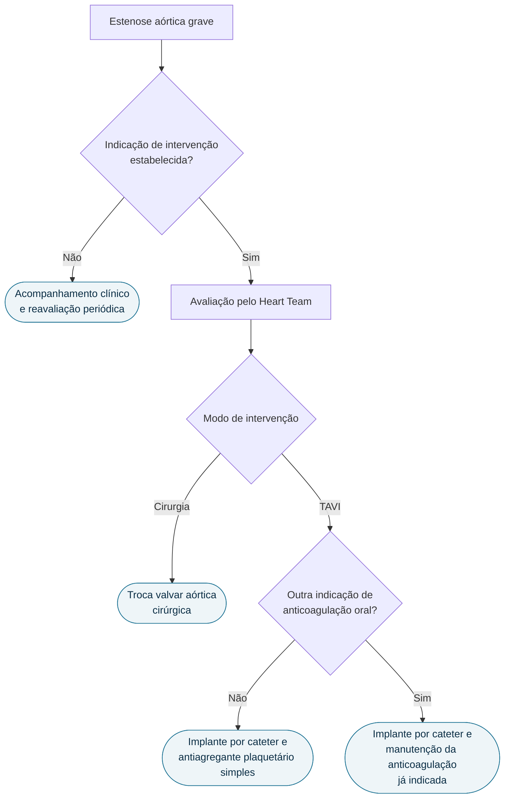

# Fluxograma: Estenose Aórtica grave — decisão de intervenção (ESC/EACTS 2021)

A diretriz europeia de 2021 **não resolve a escolha entre TAVI e cirurgia por um
corte etário rígido**. A decisão é atribuída ao Heart Team e resulta da
combinação de vários eixos — clínico, anatômico, técnico e de preferência do
paciente. O fluxograma reflete essa estrutura: a via de acesso é o último nó, não
o primeiro.

## Árvore de decisão

A decisão do Heart Team entre TAVI e cirurgia não é um teste com resposta
binária: pondera quatro conjuntos de fatores ao mesmo tempo, listados na seção
seguinte. Por isso eles não aparecem como ramos da árvore.

## Os quatro eixos da decisão do Heart Team

A escolha do modo de intervenção mais apropriado deve considerar:

1. **características clínicas** — idade e expectativa de vida estimada, condição
   geral, e os riscos relativos de cirurgia e de TAVI para aquele paciente;
2. **características anatômicas**, incluindo a viabilidade do acesso
   transfemoral para TAVI;
3. **experiência local e dados de desfecho do próprio serviço**;
4. **preferência informada do paciente**.

## Antiagregação após TAVI

Em pacientes **sem outra indicação de anticoagulante oral**, recomenda-se
antiagregante plaquetário simples após o TAVI.

## Sobre a idade como critério

As diretrizes europeia e americana concordam que idade, risco cirúrgico,
durabilidade esperada da prótese e valores do paciente devem orientar a escolha
entre TAVI e cirurgia — mas **adotam pontos de corte etários diferentes entre
si**. A abordagem da ESC/EACTS 2021 é deliberadamente mais flexível e centrada
no paciente do que uma regra de idade isolada, e é por isso que este fluxograma
não fixa um número.
