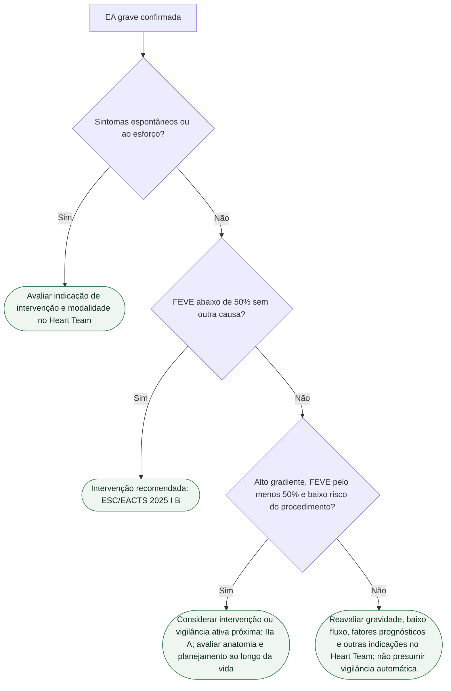

# Fluxograma: estenose aórtica grave assintomática após EARLY TAVR

O EARLY TAVR estudou TAVI transfemoral em pacientes a partir de 65 anos com FE preservada. O composto morte/AVC/internação cardiovascular foi 26,8% versus 45,3%, HR 0,50 (0,40–0,63); mortalidade isolada 8,4% versus 9,2%. A idade de inclusão do ensaio não é um limiar universal de escolha de TAVI.

## Tudo com Tudo

Valvopatias · Cardiologia geriátrica · Comunicação clínica · Insuficiência cardíaca.

## Atualização da diretriz

A ESC/EACTS 2025 (Tabela 4) recomenda intervenção na EA grave assintomática com FEVE <50% sem outra causa (I B). Com FEVE ≥50%, EA grave de alto gradiente, ausência de sintomas confirmada por teste de esforço normal quando viável e baixo risco do procedimento, a intervenção deve ser considerada como alternativa à vigilância ativa próxima (IIa A). A escolha de TAVI ou cirurgia depende do Heart Team, anatomia, idade, expectativa de vida e planejamento de intervenções futuras; a recomendação não significa TAVI automático em todos.
