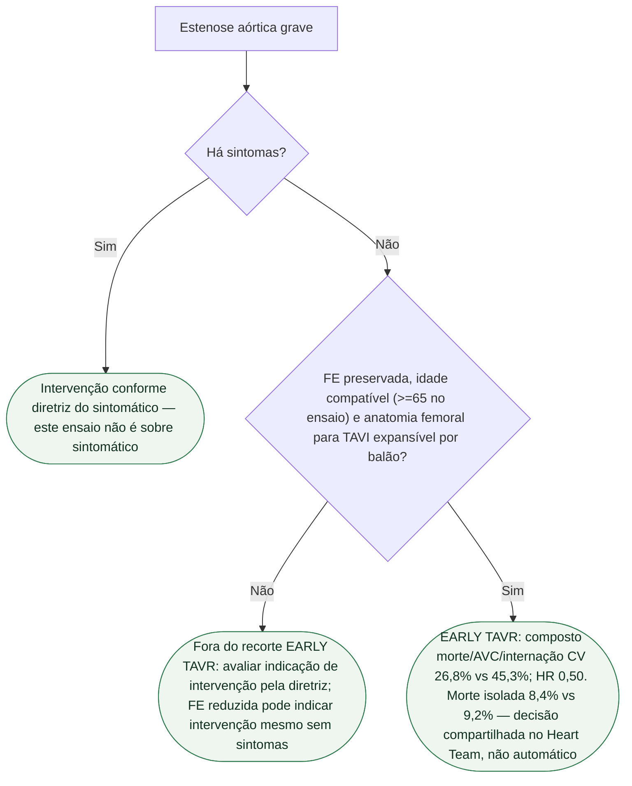

# Fluxograma: estenose aórtica grave assintomática após EARLY TAVR

## Contexto da decisão

A ESC/EACTS 2025 recomenda considerar intervenção precoce como alternativa à vigilância ativa próxima em pacientes assintomáticos (teste de esforço normal quando viável), com estenose aórtica grave de alto gradiente, FEVE ≥50% e baixo risco do procedimento (IIa A). A escolha entre TAVI e cirurgia exige avaliação individual pelo Heart Team; esta classe não equivale a TAVI obrigatório para todos.

Antes de classificar como assintomático, avaliar limitação de atividade e realizar teste de esforço quando viável. O fluxograma delimita a aplicação do ensaio e não substitui todas as indicações de tratamento da valvopatia.

## Árvore de decisão

## Tudo com Tudo

- [EARLY TAVR: TAVI precoce na estenose aórtica grave assintomática](/biblioteca/early-tavr-estenose-aortica-grave-assintomatica)
- [EARLY TAVR e PARTNER 3: comparadores e desfechos diferentes](/biblioteca/early-tavr-nao-e-partner-3-nem-e-mortalidade)
- [EARLY TAVR: o que não foi mortalidade](/biblioteca/early-tavr-o-que-nao-foi-mortalidade)
