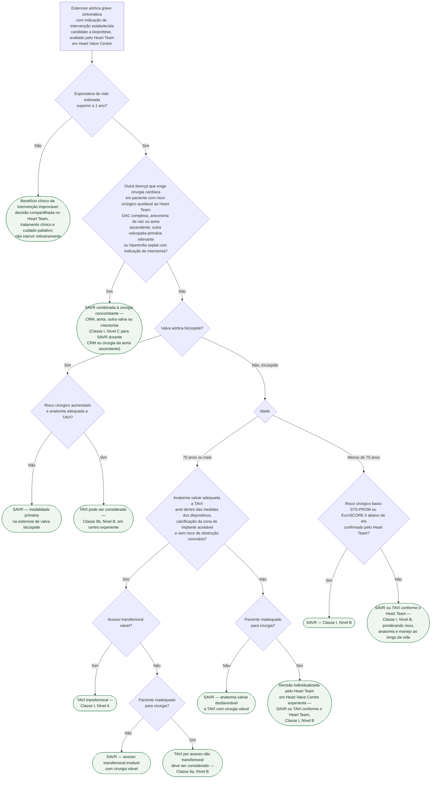

# Fluxograma: Estenose aórtica grave sintomática — TAVI ou cirurgia, escolha da modalidade (ESC/EACTS 2025)

Esta pasta já responde às duas perguntas anteriores: se a estenose aórtica grave deve ser tratada (`fluxograma-estenose-aortica-decisao-de-intervencao-esc-eacts-2021`) e quando intervir no paciente que não relata sintomas (`fluxograma-estenose-aortica-assintomatica-grave-timing-de-intervencao-esc-eacts-2025`). O que faltava era a terceira pergunta, a que mais mudou em 2025: definida a intervenção, **qual modalidade**. A ESC/EACTS 2025 baixou o corte etário preferencial para TAVI de 75 para 70 anos, mas amarrou esse corte a três condições — valva tricúspide, anatomia adequada e acesso transfemoral viável — e manteve a cirurgia como padrão abaixo de 70 anos com risco cirúrgico baixo. Usar só a idade, sem as condições, é o erro que esta árvore tenta impedir.

## Árvore de decisão

Vale para todos os ramos, e por isso não aparece como nó: a diretriz recomenda que a intervenção valvar aórtica seja feita em Heart Valve Centre com dados locais de resultado, cardiologia intervencionista e cirurgia cardíaca no mesmo serviço e Heart Team estruturado (Classe I, Nível C), e que a modalidade seja definida por esse Heart Team a partir das características clínicas, anatômicas e procedimentais individuais, incorporando o manejo ao longo da vida e a expectativa de vida estimada (Classe I, Nível C). A preferência informada do paciente entra em todas as bifurcações.

## O primeiro corte é a expectativa de vida, não a idade

A seção 8.4.1 abre com a frase que sustenta o nó D1: a estenose aórtica grave sintomática tem prognóstico desfavorável sem tratamento e a intervenção precoce é fortemente recomendada em todos os pacientes com expectativa de vida estimada superior a 1 ano. Abaixo desse limiar, a diretriz de 2025 não oferece uma linha de recomendação própria na Recommendation Table 4; o que sustenta a conduta C1 é a lógica inversa dessa frase e a orientação, no capítulo de comorbidades, de discutir futilidade em Heart Team — no paciente oncológico, com o oncologista assistente. A decisão ali é compartilhada e não deve ser tomada por idade isolada.

## Doença concomitante que exige cirurgia leva à SAVR combinada

A Recommendation Table 5 recomenda SAVR em pacientes sintomáticos ou assintomáticos com estenose aórtica grave submetidos a CRM ou a cirurgia da aorta ascendente (Classe I, Nível C); na estenose moderada, a SAVR concomitante deve ser considerada (Classe IIa, Nível C). A Figure 9 lista como condições concomitantes que favorecem a cirurgia: outra valvopatia primária relevante, DAC complexa, aneurisma de raiz ou aorta ascendente e hipertrofia septal com necessidade de miectomia. O texto é explícito quanto à coronariopatia: DAC não complexa pode ser tratada por CRM ou por ICP, enquanto DAC complexa favorece a CRM. A classe formal da Recommendation Table 5 cobre apenas a SAVR durante CRM ou cirurgia da aorta ascendente; outra valva e miectomia entram pela Figure 9, sem linha própria de recomendação. O nó D2 pressupõe risco cirúrgico aceitável: a mesma Figure 9 lista comorbidades e condições cardíacas que elevam o risco cirúrgico como fatores que favorecem o TAVI, de modo que o paciente inoperável com DAC concomitante não segue para SAVR combinada e cai na decisão individualizada do Heart Team (Classe I, Nível B), com revascularização percutânea quando a anatomia coronária permitir. O único ensaio randomizado que comparou ICP guiada por FFR mais TAVI contra SAVR mais CRM (TCW) terminou cedo e teve amostra modesta, e a diretriz não o usa para mudar essa orientação.

## Valva bicúspide: a cirurgia continua sendo a via primária

Os pacientes com valva bicúspide foram excluídos de quase todos os ensaios que compararam TAVI e SAVR. A diretriz afirma que a SAVR permanece o modo primário de tratamento da estenose bicúspide, particularmente em pacientes jovens, com aortopatia coexistente ou morfologia valvar desfavorável — calcificação intensa das cúspides, sobretudo com rafe calcificada, associa-se a lesão de raiz, leak paravalvar e mortalidade após TAVI. A única recomendação formal é restrita: TAVI pode ser considerado na estenose bicúspide grave em pacientes com risco cirúrgico aumentado, se a anatomia for adequada (Classe IIb, Nível B). O corte de 70 anos do ramo seguinte aplica-se apenas à valva tricúspide.

## O corte de 70 anos e as três condições que o acompanham

| Recomendação da Recommendation Table 4 | Classe | Nível |
|---|---|---|
| TAVI em pacientes com 70 anos ou mais com estenose de valva tricúspide, se a anatomia for adequada | I | A |
| SAVR em pacientes com menos de 70 anos, se o risco cirúrgico for baixo | I | B |
| SAVR ou TAVI para todos os demais candidatos a bioprótese aórtica, conforme avaliação do Heart Team | I | B |
| TAVI não transfemoral deve ser considerado em pacientes inadequados para cirurgia e para acesso transfemoral | IIa | B |
| TAVI pode ser considerado na estenose bicúspide grave com risco cirúrgico aumentado, se a anatomia for adequada | IIb | B |

A nota de rodapé da primeira linha define o que é "anatomia adequada": acesso transfemoral, dimensões do anel, padrão de calcificação da zona de implante e risco de obstrução coronária — os três itens valvares do nó D6 mais o acesso, perguntado em separado no nó D6b, porque a consequência de cada falha é diferente. O texto da seção 8.5.1.2 detalha os fatores anatômicos que favorecem a SAVR: anel fora das faixas de tamanho dos dispositivos disponíveis, calcificação volumosa de anel ou via de saída, que aumenta o risco de leak paravalvar e ruptura anular, e risco de obstrução coronária (altura da cúspide maior que a altura do óstio com seios de Valsalva rasos, ou grande carga de cálcio na cúspide correspondente). No sentido oposto, aorta em porcelana, deformidade torácica grave, sequela de irradiação torácica e enxertos pérvios após CRM prévia favorecem o TAVI.

A nota de rodapé da segunda linha define risco cirúrgico baixo: STS-PROM e EuroSCORE II abaixo de 4%, somados à avaliação do Heart Team — é o que o nó D8 pergunta. A diretriz justifica manter a cirurgia abaixo de 70 anos pela escassez de dados randomizados nessa faixa (os ensaios incluíram sobretudo pacientes de 70 a 85 anos) e por considerações de manejo ao longo da vida: explante cirúrgico de prótese transcateter é raro, mas tem mortalidade precoce de até 12% a 17%, e o valve-in-valve aumenta o risco de mismatch prótese-paciente e de obstrução coronária.

## Acesso transfemoral inviável

A vantagem do TAVI nos ensaios randomizados concentra-se nos pacientes tratados por via transfemoral. Quando doença ilíaco-femoral impede esse acesso, a SAVR permanece a opção preferida (conduta C6); o TAVI por acesso alternativo — transaxilar, transcarotídeo, transcaval, transinominado ou transapical — é sustentado apenas por dados observacionais e reservado ao paciente inadequado para cirurgia (conduta C7, Classe IIa, Nível B). A Recommendation Table 4 restringe essa linha a quem é inadequado "para cirurgia e para acesso transfemoral": ela não resolve o paciente cuja anatomia valvar é que é desfavorável (anel, calcificação, coronárias). Por isso a árvore separa os dois cenários — anatomia valvar inadequada com cirurgia viável vai para SAVR (conduta C10) e, se o paciente também for inoperável, sobra a linha geral da tabela, SAVR ou TAVI conforme o Heart Team, Classe I, Nível B (conduta C11), em Heart Valve Centre experiente, sem que a diretriz indique uma via de acesso alternativa como resposta. No ramo de menos de 70 anos sem risco baixo, a mesma lógica se aplica dentro da conduta C9: anatomia desfavorável ou acesso inviável com cirurgia possível pendem para SAVR, e inadequação cirúrgica abre o TAVI não transfemoral.

## Limitações e o que confirmar

- Esta árvore parte de candidato a bioprótese. Em pacientes com menos de 60 anos, a diretriz prefere prótese mecânica na posição aórtica, e a pergunta muda de "TAVI ou SAVR" para "mecânica ou biológica" — ver `fluxograma-escolha-de-protese-valvar-mecanica-vs-biologica-esc-eacts-2025`.
- A conduta para expectativa de vida inferior a 1 ano deriva do requisito positivo de benefício clínico esperado; a árvore não a rotula como recomendação Classe III nem como proibição absoluta, e prioriza decisão compartilhada e cuidado clínico/paliativo.
- O corte de 4% de STS-PROM ou EuroSCORE II define apenas o risco baixo. A diretriz de 2025 não usa um corte numérico de risco alto para indicar TAVI; "inadequado para cirurgia" é juízo do Heart Team, e a árvore respeita isso sem inventar um número.
- Estenose de baixo fluxo e baixo gradiente entra nesta árvore só depois de confirmada como grave (Classe I, Nível B com FEVE reduzida; Classe IIa, Nível B com FEVE preservada); a confirmação está fora deste fluxograma.
- Os fatores de DAC concomitante e a estratégia de ICP antes do TAVI (NOTION-3) não foram lidos na íntegra nesta sessão e não integram os ramos; a árvore usa apenas a distinção DAC complexa versus não complexa da seção 8.5.1.

## Tudo com Tudo

- [Fluxograma: Estenose Aórtica grave — decisão de intervenção e escolha da via (ESC/EACTS 2021)](/biblioteca/fluxograma-estenose-aortica-decisao-de-intervencao-esc-eacts-2021)
- [Fluxograma: Estenose Aórtica Grave Assintomática — Quando Intervir (ESC/EACTS 2025)](/biblioteca/fluxograma-estenose-aortica-assintomatica-grave-timing-de-intervencao-esc-eacts-2025)
- [Estenose Aórtica Grave: Decisão TAVI vs. SAVR (ESC/EACTS 2021)](/biblioteca/estenose-aortica-grave-decisao-tavi-vs-savr-esceacts-2021)
- [Valvopatias: Atualização Diretriz ESC/EACTS 2025](/biblioteca/valvopatias-atualizacao-diretriz-esceacts-2025)
- [Doença Valvar Cardíaca: Diagnóstico e Manejo (ESC/EACTS 2021→2025)](/biblioteca/doenca-valvar-cardiaca-diagnostico-e-manejo-esceacts-20212025)
- [Fluxograma: Escolha de Prótese Valvar — Mecânica versus Biológica, por Idade e Comorbidade (ESC/EACTS 2025)](/biblioteca/fluxograma-escolha-de-protese-valvar-mecanica-vs-biologica-esc-eacts-2025)
- [TAVI em Baixo Risco, 6–7 Anos: Durabilidade Valvar Divergente entre SAPIEN 3 (PARTNER 3) e Autoexpansível (Evolut Low Risk)](/biblioteca/tavi-baixo-risco-6-7-anos-durabilidade-valvar-partner3-evolut-low-risk)
