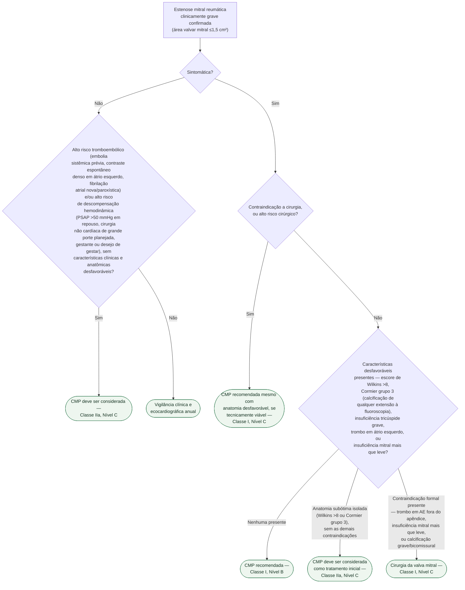

# Fluxograma: Estenose Mitral Reumática Grave — Comissurotomia Percutânea versus Cirurgia (ESC/EACTS 2025)

A estenose mitral é a valvopatia mais associada à febre reumática e uma causa
importante de morbimortalidade em países de baixa e média renda — e, ao
contrário da estenose aórtica, a decisão entre tratamento percutâneo
(comissurotomia mitral percutânea, CMP) e cirurgia depende tanto da anatomia da
valva quanto da presença de sintomas. Este fluxograma organiza essa decisão para
a estenose mitral **reumática**; a forma degenerativa por calcificação do anel
mitral (MAC) não é candidata a CMP e segue conduta própria, descrita ao final.

## Árvore de decisão

## O escore de Wilkins, resumido

O nó D4 usa o escore de Wilkins como um dos critérios de anatomia desfavorável.
São quatro componentes avaliados por ecocardiograma — mobilidade do folheto,
espessamento do folheto, calcificação, e espessamento/calcificação do aparato
subvalvular —, cada um pontuado de 1 a 4, somando de 4 a 16. Escore ≤8 prediz
sucesso do tratamento percutâneo; a própria diretriz usa **escore >8** como um
dos critérios que definem anatomia desfavorável, junto com Cormier grupo 3 e
insuficiência tricúspide grave — não é o único critério, e por isso a árvore o
trata como parte de um conjunto no nó D4, não como pergunta isolada.

## Por que sintoma decide antes da anatomia

Repare que a árvore pergunta primeiro se o paciente é sintomático (D1), e só
depois avalia contraindicação cirúrgica (D3) e anatomia desfavorável (D4). Isso
espelha a própria estrutura da diretriz: em paciente sintomático sem
contraindicação a cirurgia, a anatomia é o que decide entre CMP e cirurgia; em
paciente sintomático **com** contraindicação ou alto risco cirúrgico, a CMP é
recomendada **mesmo com anatomia desfavorável**, porque a alternativa —
operar um paciente de alto risco — costuma ser pior do que aceitar um resultado
percutâneo subótimo.

## O que a árvore não mostra

- **Estenose mitral degenerativa (calcificação do anel mitral) não está aqui.**
  Não há fusão comissural para tratar, então CMP **não é uma opção** nessa
  forma da doença — a conduta é terapia clínica, e cirurgia (tecnicamente mais
  desafiadora, mas com mortalidade <5% relatada em centros experientes) ou
  implante transcateter de valva mitral (TMVI) em paciente sintomático
  refratário e de alto risco. Detalhado no mesmo documento de origem desta
  árvore, seção de estenose mitral degenerativa.
- **Doença valvar múltipla exige avaliação separada do Heart Team** — cirurgia
  é preferida à CMP quando há doença aórtica grave associada; em doença
  aórtica moderada, a CMP pode postergar o tratamento cirúrgico das duas
  valvas.
- **DOAC deve ser evitado com área valvar mitral ≤2,0 cm²** — corte diferente do
  usado para definir gravidade clínica (≤1,5 cm²), e não representado nesta
  árvore por não ser uma decisão de intervenção.
- **Seguimento pós-CMP não está na árvore.** Reestenose assintomática pode
  ocorrer, e a área valvar e o gradiente médio pós-procedimento continuam
  sendo acompanhados por ecocardiograma.
