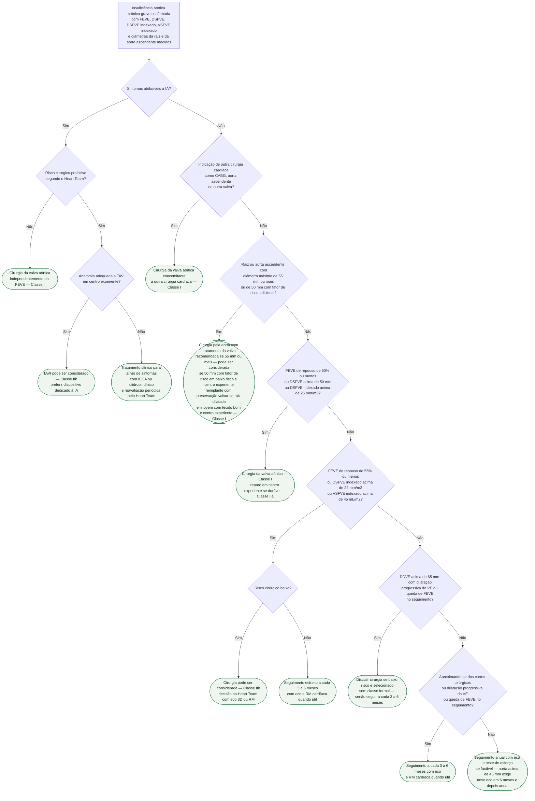

# Fluxograma: Insuficiência aórtica crônica grave — quando intervir (ESC/EACTS 2025)

A insuficiência aórtica (IA) crônica grave é tolerada por anos porque o ventrículo esquerdo se adapta com dilatação e aumento de complacência — e é justamente essa adaptação que esconde o dano. Operar tarde deixa disfunção residual que a troca valvar não reverte; operar cedo expõe um paciente assintomático ao risco cirúrgico e à prótese. A ESC/EACTS 2025 manteve os pilares de 2021 (sintoma manda; FEVE, diâmetro sistólico e aorta decidem no assintomático) e mexeu na zona cinzenta: o corte indexado da recomendação IIb subiu de 20 para 22 mm/m2, o volume sistólico final indexado entrou como critério, o reparo valvar subiu para Classe IIa e o TAVI para IA nativa ganhou entrada formal na tabela. Esta árvore organiza essa sequência para o paciente com IA crônica grave já confirmada por avaliação integrada ao ecocardiograma (com RM cardíaca ou eco 3D nos casos limítrofes). A IA aguda — endocardite, dissecção — não entra aqui: a própria diretriz remete às diretrizes específicas.

## Árvore de decisão

## Sintomático: cirurgia, e TAVI só quando a cirurgia é inviável

Em IA grave sintomática a cirurgia da valva aórtica é recomendada **independentemente da função ventricular** (Classe I, Nível B), a menos que o risco cirúrgico estimado seja proibitivo. A novidade de 2025 é que o TAVI, que em 2021 aparecia apenas em prosa, agora tem entrada própria na tabela: **pode ser considerado em paciente sintomático inelegível para cirurgia segundo o Heart Team, se a anatomia for adequada** (Classe IIb, Nível B). A diretriz é explícita sobre o preço: com próteses não dedicadas o uso é off-label, com mais malposicionamento e IA residual e cerca de 10% de segunda valva ou conversão cirúrgica; os dispositivos dedicados reduzem migração e IA residual, mas com taxa de marcapasso definitivo novo de 24%. Quando nem cirurgia nem TAVI são possíveis, IECA ou diidropiridínico podem aliviar sintomas — a diretriz não recomenda esses fármacos para adiar cirurgia no assintomático, e pede cautela com betabloqueador, que alonga a diástole e aumenta o volume regurgitante.

## Assintomático: outra cirurgia cardíaca e aorta dilatada decidem antes do ventrículo

Dois ramos precedem os cortes ventriculares. Primeiro: se o paciente com IA grave vai ser operado por outro motivo — revascularização, aorta ascendente ou outra valva —, a valva aórtica é tratada na mesma cirurgia, sintomático ou não (Classe I, Nível C). Segundo: a **dilatação da aorta dita a cirurgia independentemente da gravidade da IA**. O texto de 2025 repete os cortes da diretriz de aorta de 2024: cirurgia recomendada com diâmetro máximo de raiz ou aorta ascendente **≥ 55 mm**, e **50 mm pode ser considerado** em paciente selecionado de baixo risco, com fator de risco adicional, em centro experiente — os cortes por etiologia (Marfan, bicúspide, Loeys-Dietz) estão no fluxograma de aneurisma torácico do acervo. Nesse cenário, o reimplante com preservação valvar é recomendado em paciente jovem com dilatação de raiz, em centro experiente e com resultado durável esperado (Classe I, Nível B), e o texto o coloca como superior ao tubo valvado tipo Bentall em mortalidade e morbidade de longo prazo quando as cúspides são maleáveis e de boa qualidade.

O que vale para qualquer ramo cirúrgico: quando a cirurgia valvar já está indicada e o risco cirúrgico previsto é baixo, a substituição concomitante da raiz ou da aorta ascendente **deve ser considerada a partir de 45 mm** (Classe IIa, Nível C), pesando idade, superfície corporal, etiologia, valva bicúspide e o aspecto intraoperatório da parede — limiar mais bem demonstrado na bicúspide.

## Os dois patamares ventriculares

| Patamar | Critério (assintomático, IA grave) | Classe/Nível 2025 | Como era em 2021 |
|---|---|---|---|
| Indicação firme | FEVE de repouso ≤ 50%, ou DSFVE > 50 mm, ou DSFVEi > 25 mm/m2 (sobretudo se SC < 1,68 m2) | I, B | Igual (I, B) |
| Zona IIb, só em baixo risco cirúrgico | FEVE de repouso ≤ 55%, ou DSFVEi > 22 mm/m2, ou VSFVEi > 45 mL/m2 por eco ou RM (sobretudo se SC < 1,68 m2) | IIb, B | DSFVEi > 20 mm/m2 ou FEVE ≤ 55% (IIb, C); sem critério volumétrico |
| Sem classe formal | DDVE > 65 mm com aumento progressivo dos diâmetros e/ou queda de FEVE no seguimento | Prosa, "pode ser discutida" em baixo risco selecionado | Prosa, igual |

DSFVE, diâmetro sistólico final do VE; DSFVEi e VSFVEi, diâmetro e volume sistólicos finais indexados à superfície corporal (SC). A base do patamar IIb continua observacional — estudos ecocardiográficos que sugerem melhor prognóstico com intervenção precoce —, e por isso só se aplica quando a cirurgia é de baixo risco; o nível subiu de C para B. A diretriz cita ainda um corte volumétrico por RM de VSFVEi ≥ 43 mL/m2 proposto recentemente, com valor preditivo aparentemente superior ao do diâmetro, mas ele não entrou na tabela de recomendações. Strain longitudinal reduzido, reserva contrátil ao estresse, BNP elevado e fibrose por RM entram como modificadores na discussão do Heart Team, sem corte próprio.

## Reparo versus troca

A troca valvar continua sendo a abordagem padrão na maioria dos casos de IA. O reparo, porém, subiu de IIb para **IIa (Nível B)**: deve ser considerado em paciente selecionado, em centro experiente, quando se espera resultado durável. Na valva bicúspide, o grau de simetria do fenótipo prediz a reparabilidade e o resultado tardio, e preservação ou reparo devem ser considerados conforme idade, anatomia e experiência do centro. Em jovens bem selecionados, o autoenxerto pulmonar (Ross) é citado como alternativa razoável à prótese. A escolha entre prótese mecânica e biológica, quando se opta pela troca, segue a árvore própria do acervo.

## Quem segue em observação

| Situação | Intervalo de seguimento (ESC/EACTS 2025) |
|---|---|
| IA grave assintomática fora dos cortes | Anual, com ecocardiograma |
| Aproximando-se dos cortes, ou dilatação progressiva do VE ou queda de FEVE | A cada 3 a 6 meses; RM cardíaca especialmente útil |
| IA moderada | Consulta anual, ecocardiograma a cada 2 anos |
| Aorta ascendente dilatada ao primeiro eco | TC ou RM sincronizada ao ECG para confirmar o diâmetro máximo; se > 45 mm, novo eco em 6 meses e depois anual; aumento > 3 mm confirmado por angio-TC ou RM |

No assintomático sem critério cirúrgico, o teste de esforço deve ser feito quando factível — para desmascarar sintoma e medir capacidade funcional, não para quantificar a regurgitação (ver ecocardiograma-sob-estresse-nas-valvopatias-indicacoes-sbc-2024). Em IA moderada com indicação de revascularização ou cirurgia mitral, a decisão de tratar a valva aórtica é do Heart Team, porque a progressão da IA moderada pode ser muito lenta.

## Limitações e o que confirmar

- Todos os cortes, classes e níveis acima foram lidos na seção 7 e na Recommendation Table 3 do texto integral de 2025; nenhum valor ficou sem confirmação, e por isso não há marcação de verificação pendente nesta árvore.
- A ordem dos ramos é uma escolha didática: a Figura 5 da diretriz começa pela dilatação da raiz e só depois pergunta por sintomas e elegibilidade cirúrgica; aqui o sintoma vem primeiro. Um paciente pode satisfazer vários ramos ao mesmo tempo (aorta dilatada e FEVE baixa, por exemplo); a árvore para no primeiro que já define cirurgia.
- "Fator de risco adicional" para o corte de 50 mm de aorta e os cortes específicos de Marfan, bicúspide e Loeys-Dietz vêm da diretriz de aorta ESC 2024, não desta; use o fluxograma de aneurisma torácico do acervo para essa parte.
- O ramo "risco cirúrgico proibitivo" e o ramo "risco cirúrgico baixo" não têm valor numérico de escore na diretriz: são julgamentos do Heart Team, não cortes de STS ou EuroSCORE.
- O corte volumétrico por RM (VSFVEi ≥ 43 mL/m2) e os marcadores de disfunção subclínica (strain, BNP, fibrose) estão em prosa na diretriz, sem classe; a árvore não os usa como ramo.
- A IA aguda fica fora desta árvore; endocardite e dissecção seguem as diretrizes específicas, e o ramo de dissecção está no fluxograma de síndrome aórtica aguda.

## Tudo com Tudo

- [Regurgitação Aórtica Crônica e Aguda: Indicação Cirúrgica (ESC/EACTS 2021)](/biblioteca/regurgitacao-aortica-cronica-e-aguda-indicacao-cirurgica-esceacts-2021)
- [Valvopatias: Atualização Diretriz ESC/EACTS 2025](/biblioteca/valvopatias-atualizacao-diretriz-esceacts-2025)
- [Regurgitação Aórtica Nativa Grave: Tratamento Transcateter Dedicado — ALIGN-AR e o Sistema Trilogy](/biblioteca/regurgitacao-aortica-nativa-grave-tratamento-transcateter-dedicado-align-ar-trilogy)
- [Fluxograma: Aneurisma de Aorta Torácica — Corte de Reparo por Etiologia e Vigilância (ESC 2024)](/biblioteca/fluxograma-aneurisma-de-aorta-toracica-cortes-por-etiologia-esc-2024)
- [Fluxograma: Escolha de Prótese Valvar — Mecânica versus Biológica, por Idade e Comorbidade (ESC/EACTS 2025)](/biblioteca/fluxograma-escolha-de-protese-valvar-mecanica-vs-biologica-esc-eacts-2025)
- [Ecocardiograma sob estresse nas valvopatias: indicações lesão a lesão (SBC 2024)](/biblioteca/ecocardiograma-sob-estresse-nas-valvopatias-indicacoes-sbc-2024)
- [Fluxograma: Síndrome aórtica aguda — da dor torácica ao tratamento (ESC 2024)](/biblioteca/fluxograma-sindrome-aortica-aguda-esc-2024)
