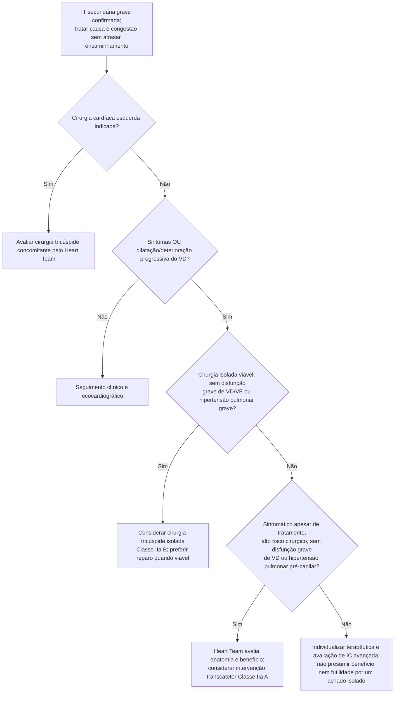

# Fluxograma: Insuficiência Tricúspide Secundária Grave — Quando Intervir (ESC/EACTS 2025 e TRILUMINATE Pivotal)

Por décadas a insuficiência tricúspide (IT) grave isolada foi tratada quase só
com diurético — a cirurgia isolada de valva tricúspide tem mortalidade
operatória elevada em paciente já com disfunção de ventrículo direito, e a
maioria nunca chegava a ser operada. O reparo transcateter borda a borda mudou
esse cenário a partir de 2023, mas nem todo paciente com IT grave sintomática é
candidato — a seleção correta, mais do que a gravidade da regurgitação, é o que
determina se o procedimento vale a pena. Este fluxograma organiza essa seleção
para a IT **secundária** (dilatação do anel/ventrículo direito, em geral por
hipertensão pulmonar, fibrilação atrial ou doença do coração esquerdo).

## Árvore de decisão

## O que o TRILUMINATE Pivotal realmente mostrou

O ensaio que sustenta a Classe IIa/A do nó C4 (350 pacientes, TriClip mais
terapia clínica versus terapia clínica isolada) teve desfecho primário positivo
por *win ratio* (1,48; IC95% 1,06-2,13; p=0,02) — mas o componente que carregou
esse resultado foi **qualidade de vida**, não desfecho duro: morte por qualquer
causa ou cirurgia da valva tricúspide (9,4% vs. 10,6%) e hospitalização por
insuficiência cardíaca (0,21 vs. 0,17 evento por paciente-ano) foram
praticamente iguais entre os grupos. A melhora de qualidade de vida pelo KCCQ
foi grande e consistente (+11,7 pontos de diferença, p<0,001). Dizer ao
paciente que o procedimento "melhora sintomas e qualidade de vida" é o que o
ensaio sustenta; o resultado inicial de um ano não demonstrou redução desses componentes. A análise randomizada de dois anos publicada em2025 mostrou redução de hospitalizações recorrentes por IC, mantendo ausência de benefício demonstrado em mortalidade (PMID40159089; DOI:10.1161/CIRCULATIONAHA.125.074536). Não apresentar o seguimento inicial como toda a evidência atual.

## Limites de elegibilidade
Os critérios da cirurgia isolada e da intervenção transcateter não são idênticos na Tabela9. A cirurgia considera ausência de disfunção grave de VD/VE e hipertensão pulmonar grave; a recomendação transcateter destaca ausência de disfunção grave de VD ou hipertensão pulmonar pré-capilar. Avaliar reversibilidade, gravidade e benefício esperado em Heart Team, sem converter a árvore em declaração automática de futilidade.

## Por que a cirurgia isolada não pode desaparecer da árvore

Ausência de outra cirurgia cardíaca indicada não equivale a inoperabilidade.
Na IT secundária grave, a ESC/EACTS 2025 orienta considerar cirurgia isolada no
paciente sintomático e operável, antes que disfunção avançada de VD/VE ou
hipertensão pulmonar tornem a intervenção fútil. A mortalidade historicamente
alta da cirurgia tricúspide isolada reflete em parte encaminhamento tardio; ela
não justifica desviar automaticamente todo paciente para tratamento
transcateter.

## O que a árvore não mostra

- **IT primária segue algoritmo diferente**, não coberto aqui — endocardite de
  valva tricúspide, lesão de folheto por cabo de marca-passo/CDI e doença
  carcinoide têm mecanismo e conduta próprios, tratados em documentos dedicados
  desta pasta.
- **Estenose tricúspide reumática** é outra doença, com conduta distinta
  (documentada em `estenose-tricuspide-reumatica-diagnostico-e-manejo.md`,
  nesta pasta) — não confundir com a insuficiência secundária desta árvore.
- **Substituição valvar tricúspide transcateter e anuloplastia transcateter**
  são opções além do reparo borda a borda, com corpo de evidência próprio
  (sistema Evoque, estudado no TRISCEND II), ainda não incorporadas nesta
  árvore.
- **A árvore não substitui a avaliação do Heart Team.** Anatomia do anel,
  tamanho e mobilidade dos folhetos, e a relação entre gravidade da IT e o
  grau de remodelamento do VD são avaliados caso a caso antes de qualquer
  intervenção.

Cabo de marca-passo/CDI pode coexistir com IT secundária: sua presença não prova lesão causal nem exclui automaticamente tratamento transcateter. Definir mecanismo e interferência com a anatomia/procedimento.
