# Fluxograma: Regurgitação mitral grave — mecanismo antes da conduta (ESC/EACTS 2025)

O erro mais comum na regurgitação mitral não é errar a gravidade: é tratar as
três doenças como se fossem uma. **Regurgitação primária** é da válvula;
**secundária ventricular** é do ventrículo remodelado; **secundária atrial** é do
átrio dilatado pela fibrilação atrial. Mesmo grau de regurgitação, condutas
diferentes e classes de recomendação diferentes — por isso o mecanismo é a
primeira bifurcação da árvore, não um detalhe do laudo.

A diretriz de 2025 traz duas mudanças que a árvore reflete: o **reparo cirúrgico
no assintomático** virou Classe I, e a **regurgitação secundária atrial ganhou
definição própria** e recomendação separada pela primeira vez em documento
oficial.

## Árvore de decisão

```mermaid
flowchart TD
  R0["Regurgitação mitral grave<br/>confirmada por ecocardiograma"] --> D1{"Mecanismo da regurgitação"}

  D1 -->|"Primária<br/>(doença da válvula)"| D2{"Sintomática?"}

  D2 -->|"Sim"| D3{"Reparo cirúrgico durável viável<br/>e risco cirúrgico aceitável?"}
  D3 -->|"Sim"| C1(["Reparo valvar mitral cirúrgico"])
  D3 -->|"Não: alto risco cirúrgico<br/>e anatomia favorável"| C2(["Reparo percutâneo borda a borda (M-TEER)<br/>— Classe IIa, nível B"])

  D2 -->|"Não"| D4{"Marcador de indicação<br/>de intervenção presente?"}
  D4 -->|"Sim"| C3(["Reparo valvar mitral cirúrgico<br/>— Classe I, nível B"])
  D4 -->|"Não"| C4(["Vigilância clínica e ecocardiográfica seriada"])

  D1 -->|"Secundária ventricular<br/>(remodelamento do VE)"| P1["Otimizar o tratamento da insuficiência cardíaca<br/>e resolver revascularização e ressincronização"]
  P1 --> D5{"Permanece sintomática<br/>apesar do tratamento otimizado?"}
  D5 -->|"Não"| C5(["Manter tratamento clínico otimizado<br/>e reavaliar periodicamente"])
  D5 -->|"Sim"| D6{"Anatomia adequada e critérios<br/>de seleção preenchidos?"}
  D6 -->|"Sim"| C6(["Reparo percutâneo borda a borda (M-TEER)<br/>— Classe I, nível A"])
  D6 -->|"Não"| C7(["Decisão do Heart Team:<br/>cirurgia valvar ou terapia avançada<br/>de insuficiência cardíaca"])

  D1 -->|"Secundária atrial<br/>(dilatação do AE, FA)"| P2["Tratar a causa: controle do ritmo da fibrilação atrial<br/>e tratamento da insuficiência cardíaca"]
  P2 --> D7{"Permanece sintomática<br/>apesar do tratamento otimizado?"}
  D7 -->|"Não"| C8(["Manter tratamento clínico<br/>e controle do ritmo"])
  D7 -->|"Sim"| D8{"Risco cirúrgico aceitável?"}
  D8 -->|"Sim"| C9(["Cirurgia com anuloplastia, ablação de FA<br/>e oclusão do apêndice atrial esquerdo<br/>— Classe IIa, nível B"])
  D8 -->|"Não"| C10(["Reparo percutâneo borda a borda (M-TEER)<br/>— Classe IIb, nível B"])

  classDef conduta fill:#eef6ef,stroke:#2f7a4f,color:#12301f;
  class C1,C2,C3,C4,C5,C6,C7,C8,C9,C10 conduta;
```

O reparo percutâneo borda a borda aparece três vezes na árvore, com **três
classes de recomendação diferentes** — IIa na primária, I na secundária
ventricular, IIb na secundária atrial. Não é redundância do diagrama: é o dado
clínico mais importante desta página. O mesmo procedimento tem força de evidência
distinta conforme o mecanismo, e é por isso que o mecanismo vem antes.

## Os marcadores de indicação no assintomático

O nó `D4` da árvore não lista os critérios porque eles são **entradas de uma
mesma avaliação**, não bifurcações sucessivas. A intervenção no paciente
assintomático com regurgitação primária grave é indicada quando há:

- **fração de ejeção do VE ≤ 60%**;
- **diâmetro sistólico final do VE ≥ 40 mm**, ou **indexado ≥ 20 mm/m²** — o
  valor indexado é acréscimo da diretriz de 2025, e corrige o principal ponto
  cego do critério absoluto: o paciente de pequena superfície corporal, em quem
  40 mm chega tarde demais;
- **fibrilação atrial**;
- **pressão sistólica de artéria pulmonar > 50 mmHg**;
- **dilatação significativa do átrio esquerdo**;
- **regurgitação tricúspide secundária concomitante**.

A lógica da recomendação Classe I é operar **antes** de o ventrículo perder
função, num centro em que o reparo durável seja provável — a mortalidade
operatória do reparo mitral em centro de alto volume é inferior a 1%. Onde o
reparo durável não for esperado, a conta muda: aguardar tem custo, mas trocar a
válvula em paciente assintomático também.

## Por que a secundária ventricular exige o tratamento clínico antes

Na regurgitação secundária ventricular a válvula é anatomicamente normal: ela
fecha mal porque o ventrículo dilatou e deslocou os músculos papilares. Tratar a
válvula sem antes otimizar o tratamento da insuficiência cardíaca — e sem
resolver a indicação de revascularização e de ressincronização — é tratar a
consequência. Parte dos pacientes deixa de ter regurgitação grave só com o
tratamento clínico otimizado, e nesse caso a intervenção valvar deixa de estar
indicada.

A recomendação **Classe I, nível A** para o M-TEER se aplica a pacientes
**muito selecionados** que permanecem sintomáticos apesar do tratamento
otimizado — **confirmado na Recommendation Table 7 da diretriz**: a redação
literal é *"TEER is recommended to reduce HF hospitalizations and improve
quality of life in haemodynamically stable, symptomatic patients with impaired
LVEF (<50%) and persistent severe ventricular SMR, despite optimized GDMT and
CRT (if indicated), fulfilling specific clinical and echocardiographic
criteria"*, e a própria diretriz coloca essa recomendação sob o título "Severe
ventricular secondary mitral regurgitation **without concomitant coronary
artery disease**" (Figura 13 e seção 9.2.4.2) — a fonte secundária estava
certa: a Classe I/A vale só na **ausência** de DAC relevante. Quando há DAC
concomitante exigindo revascularização, a diretriz separa a conduta: cirurgia
valvar mitral é recomendada (Classe I, nível B) se o paciente já for para CRM;
cirurgia pode ser considerada (Classe IIb, nível B) na regurgitação moderada
associada a CRM; e ICP seguida de TEER após reavaliação da regurgitação pode
ser considerada (Classe IIb, nível C) no paciente sintomático com DAC não
complexa.

## A novidade da secundária atrial

Até 2021 a regurgitação secundária atrial não tinha definição em diretriz: era
tratada por analogia com a ventricular, o que nunca fez sentido mecânico — o
ventrículo é normal, quem dilatou foi o átrio, em geral por fibrilação atrial de
longa duração. A diretriz de 2025 a define e separa a conduta: a cirurgia com
anuloplastia, ablação de fibrilação atrial e oclusão do apêndice atrial esquerdo
é Classe IIa quando o risco cirúrgico é aceitável, e o M-TEER fica reservado a
quem não é candidato à cirurgia.

Repare no que a cirurgia recomendada faz: trata a válvula, a arritmia e o risco
tromboembólico no mesmo tempo cirúrgico. É coerente com a fisiopatologia — sem
controle do ritmo, o átrio que causou a regurgitação continua lá.

## O que a árvore não mostra

**Gravidade é pré-requisito, não conclusão.** A árvore parte de regurgitação
grave já estabelecida por ecocardiograma. Os critérios de gravidade — área do
orifício regurgitante efetivo, volume regurgitante, fração regurgitante e sinais
indiretos — estão nos documentos de valvopatias desta mesma pasta.

**Todo caso passa pelo Heart Team.** As decisões entre cirurgia e via percutânea
dependem de risco cirúrgico, anatomia, expectativa de vida, experiência do
serviço e preferência informada do paciente. A árvore mostra o caminho da
recomendação; ela não substitui a discussão em equipe.

**Fibrilação atrial concomitante tem conduta própria** — controle de ritmo,
anticoagulação e avaliação do apêndice atrial esquerdo — que se aplica a todos os
ramos e por isso não aparece no diagrama.
