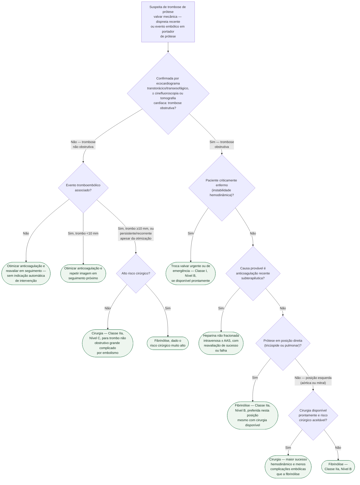

# Fluxograma: Trombose de Prótese Valvar Mecânica — Fibrinólise versus Cirurgia (ESC/EACTS 2021)

Trombose de prótese mecânica é emergência potencial mesmo quando o paciente
parece estável — o atraso na decisão entre fibrinólise e cirurgia piora
desfecho. A diretriz ESC/EACTS 2021 separa a decisão em dois ramos, obstrutiva e
não obstrutiva, e dentro de cada um o achado clínico decide o próximo passo.
Este fluxograma converte esse algoritmo — descrito em prosa no documento de
origem desta pasta — em árvore de decisão formal.

## Árvore de decisão

## Os números que sustentam a preferência por cirurgia (nó D7)

A referência citada pela própria diretriz (Roudaut R et al., Arch Cardiovasc
Dis 2009) comparou 263 episódios de obstrução de prótese valvar em 210
pacientes: mortalidade precoce **igual** entre cirurgia e fibrinólise (10% nos
dois grupos), mas sucesso hemodinâmico maior com cirurgia (89% vs. 70,9%) e
episódios embólicos bem menores (0,7% vs. 15%). É por isso que o nó D7 favorece
cirurgia quando ela está prontamente disponível e o risco cirúrgico é
aceitável — a mortalidade não muda, mas a chance de resolver o problema sem
complicação embólica é maior.

## Por que a posição direita muda a resposta (nó D6)

Fibrinólise em prótese tricúspide/pulmonar tem preferência mesmo com cirurgia
disponível — situação distinta da posição esquerda. O risco de embolização
pulmonar associado à fibrinólise nesse território é menor do que o risco de
embolização sistêmica/cerebral que preocupa na posição esquerda, o que muda o
balanço risco-benefício a favor do tratamento farmacológico.

## O que a árvore não mostra

- **Trombose de bioprótese não segue esta árvore.** Tem primeira linha
  farmacológica (anticoagulação com AVK e/ou heparina, Classe I, Nível C),
  não cirúrgica — a distinção entre trombo e pannus por tomografia também
  importa aqui, e está descrita à parte no documento de origem.
- **Falha de fibrinólise com alto risco cirúrgico é reconhecida pela própria
  diretriz como decisão particularmente difícil**, sem algoritmo fechado —
  cabe à Heart Team individualizar, e por isso não aparece como ramo desta
  árvore.
- **O esquema posológico da fibrinólise não está na árvore** — ativador de
  plasminogênio tecidual recombinante (10 mg em bolus + 90 mg em 90 minutos,
  com heparina não fracionada) ou estreptoquinase (1.500.000 U em 60 minutos,
  sem heparina) estão detalhados no documento de origem.
- **A revisão de 2026** (Raj Mantoo M et al.) reforça que a prática vem se
  deslocando para decisão individualizada guiada por imagem, mas isso não
  substitui — e é consistente com — a árvore da diretriz vigente reproduzida
  acima.
