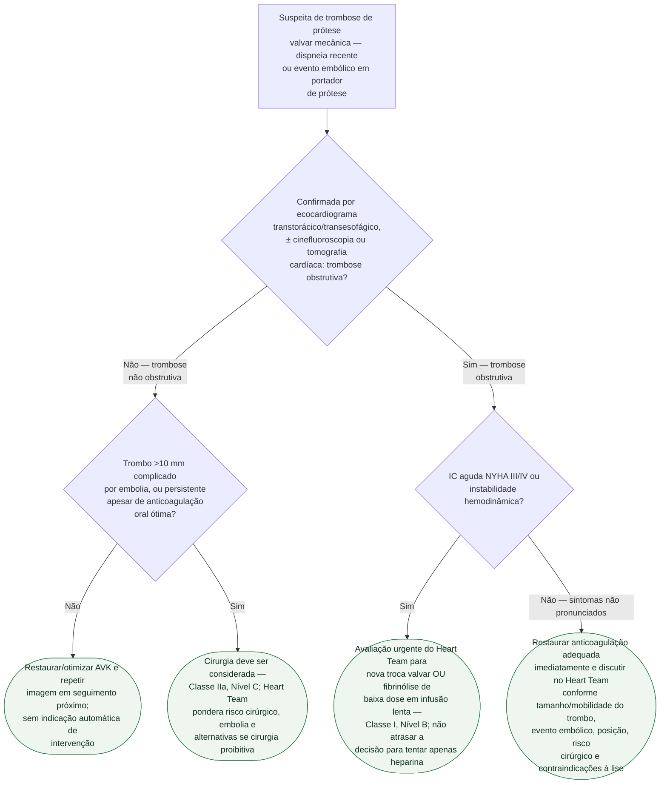

# Fluxograma: Trombose de Prótese Valvar Mecânica — Fibrinólise versus Cirurgia (ESC/EACTS 2025)

Trombose de prótese mecânica é emergência potencial mesmo quando o paciente
parece estável — o atraso na decisão entre fibrinólise e cirurgia piora
desfecho. A diretriz ESC/EACTS 2025 separa a decisão em dois ramos, obstrutiva e
não obstrutiva, e exige avaliação do Heart Team quando a obstrução causa IC
aguda importante. Este fluxograma organiza essa decisão sem reutilizar o
esquema acelerado de fibrinólise da versão de 2021.

## Árvore de decisão

## Por que a diretriz 2025 exige Heart Team

Cirurgia e fibrinólise têm riscos relevantes e nenhum único critério escolhe
sempre a melhor opção. A diretriz atual incorpora a fibrinólise de baixa dose
em infusão lenta como alternativa à nova troca valvar na IC NYHA III/IV e exige
decisão urgente com base em risco cirúrgico, contraindicações hemorrágicas,
posição e geração da prótese, tamanho do trombo e expertise local.

## O que a árvore não mostra

- **Trombose de bioprótese não segue esta árvore.** Tem primeira linha
  farmacológica com AVK (Classe I, Nível B na ESC/EACTS 2025),
  não cirúrgica — a distinção entre trombo e pannus por tomografia também
  importa aqui, e está descrita à parte no documento de origem.
- **Falha de fibrinólise com alto risco cirúrgico é reconhecida pela própria
  diretriz como decisão particularmente difícil**, sem algoritmo fechado —
  cabe à Heart Team individualizar, e por isso não aparece como ramo desta
  árvore.
- **O esquema posológico da fibrinólise não está na árvore.** A ESC/EACTS 2025
  passou a favorecer baixa dose em infusão lenta; protocolo, contraindicações e
  monitorização devem ser definidos pelo Heart Team, não transcritos de um
  esquema acelerado antigo.
- **A revisão de 2026** (Raj Mantoo M et al.) reforça que a prática vem se
  deslocando para decisão individualizada guiada por imagem, mas isso não
  substitui — e é consistente com — a árvore da diretriz vigente reproduzida
  acima.
