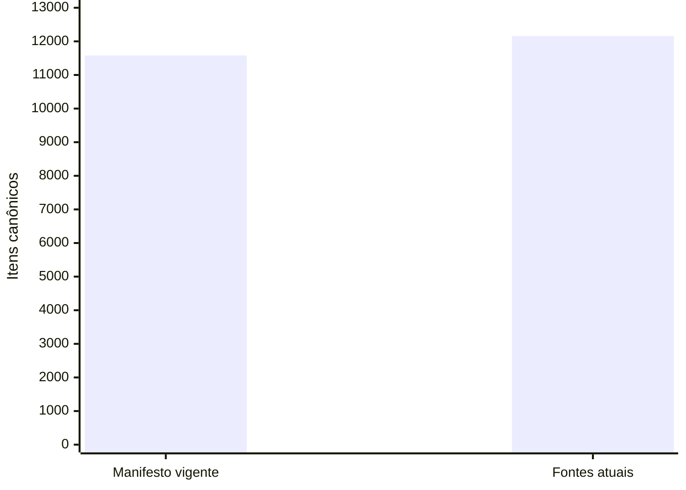

# Tudo com Tudo: referências e autorização do corpus

Auditoria somente leitura em 09/09/2026. Nenhum conteúdo, link, status de revisão, publicação ou autorização foi alterado.

## Referências: 20 de 20 resolvidas em produção

Os 20 alertas `missing_target` do auditor do checkout correspondem a 14 slugs distintos. Todos foram encontrados **exatamente**, como documentos publicados no banco de produção, com títulos correspondentes. Os links existentes foram preservados.

Os 14 documentos estão ausentes tanto do checkout auditado quanto da fonte canônica `/content` montada no backend. Portanto, existe uma divergência entre fontes e banco que precisa ser tratada na preparação da publicação. Estes alertas não demonstram 20 links quebrados para o usuário no estado atual.

A verificação foi de identidade e publicação dos destinos; não foi um novo julgamento da qualidade científica dos documentos nem um teste visual de cada página.

## Aprovação: manifesto vigente incompatível com o inventário atual

O runtime aponta explicitamente para `/editorial-approvals/full-corpus-release-20260907.json`. Ele exige o inventário exato de 11.581 itens. A função de validação existente, executada sem reconciliar ou alterar o banco, encontrou 12.160 itens nas fontes montadas e rejeitou a autorização.

Diferença: **579 itens**. A frente de documentos passou de 2.430 no manifesto para 3.009 nas fontes atuais; as demais contagens conciliam nesse total.

Erro retornado: `Autorização integral diverge do total canônico: manifesto=11581, atual=12160.`

## Como interpretar os 545 alertas editoriais

O auditor genérico reconhece aprovações do tipo `approved_for_publication`, mas ignora o tipo integral `approved_for_full_corpus_publication`. A opção `--approval-manifest` também aceita apenas o tipo simples: passar o manifesto integral por essa opção não resolveria a diferença.

Assim:

- Os 545 alertas não comprovam que existem 545 documentos clinicamente não revisados: os registros apontados já declaram `review_status=revisado`.
- Também não podem ser descartados como falsos positivos de configuração, pois a autorização integral existente está efetivamente incompatível com as fontes atuais.
- A pendência de lançamento é conciliar a origem/versionamento do conteúdo e sua autorização efetiva, mantendo a política existente. Esta auditoria não cria nem renova autorização e não certifica o corpus integral para publicação.

Evidências reproduzíveis:

- [Referências, caminhos e destinos publicados](tct-corpus-reference-reconciliation-20260909.json)
- [Validação da autorização no runtime](tct-runtime-approval-audit-20260909.json)
