# Atlas visual — Avaliação Cardiológica Pré-Operatória de Risco Cirúrgico

> Metadados de produção: `{"fonte_producao":"chatgpt","frente":"documento_biblioteca","tema":"Perioperatório","revisado_por_voce":false}`
>
> **Status:** conteúdo científico produzido pelo ChatGPT a partir de fontes primárias consultadas; a decisão final de marcar como revisado/publicado pertence ao fluxo de validação da Corvia.

## Objetivo

Este documento transforma os principais métodos de avaliação cardiovascular perioperatória em **árvores de decisão clínicas**. A ideia central é impedir que um número isolado — RCRI, Gupta MICA, DASI ou qualquer outro — seja confundido com a avaliação pré-operatória inteira.

O modelo proposto para a Corvia é um **Risk Stack** em camadas:

1. urgência e doença cardiovascular ativa;
2. risco clínico/procedimental por ferramenta validada;
3. reserva funcional e fragilidade;
4. biomarcadores quando indicados;
5. exames adicionais apenas quando o resultado puder mudar conduta.

---

## 1. Risk Stack perioperatório — visão geral

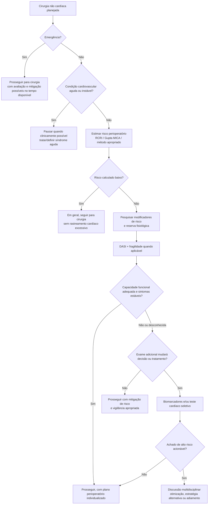

### Como interpretar

- **Risco baixo** não significa risco zero; significa que a probabilidade estimada de MACE é suficientemente pequena para que rastreamento adicional rotineiro tenha baixo rendimento.
- **Risco elevado** não significa “pedir teste ergométrico”. Significa abrir as camadas seguintes do Risk Stack.
- **Exame pré-operatório só tem valor se puder alterar conduta** — princípio central da AHA/ACC 2024.

---

## 2. RCRI — Revised Cardiac Risk Index

### O que responde

“Quantos dos seis preditores clássicos de complicação cardíaca maior estão presentes?”

Preditores originais de Lee et al.:

- cirurgia de alto risco;
- doença isquêmica cardíaca;
- insuficiência cardíaca;
- doença cerebrovascular;
- diabetes tratado com insulina;
- creatinina sérica pré-operatória >2,0 mg/dL.

Na coorte de validação original, a taxa de complicação cardíaca maior foi 0,4%, 0,9%, 7% e 11% para 0, 1, 2 e ≥3 fatores, respectivamente.

### Árvore de decisão

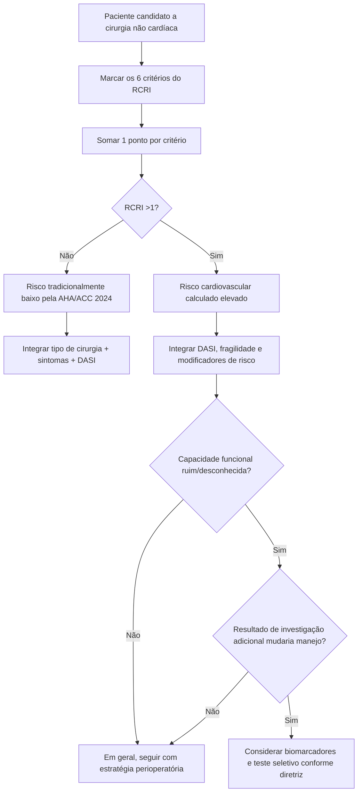

### Armadilhas

- O RCRI **não contém idade nem capacidade funcional**.
- A definição histórica de “cirurgia de alto risco” do RCRI não é intercambiável com todas as classificações cirúrgicas contemporâneas.
- As taxas de 0,4/0,9/7/11% pertencem à **coorte de validação original**, não são uma promessa de risco absoluto para qualquer população moderna.

**Fonte primária:** Lee TH et al. *Circulation*. 1999;100(10):1043-1049. PMID 10477528. DOI 10.1161/01.CIR.100.10.1043.

---

## 3. Gupta MICA

### O que responde

“Qual é a probabilidade individual estimada de infarto do miocárdio ou parada cardíaca perioperatória?”

O modelo original deriva a estimativa de cinco domínios:

- idade;
- status funcional;
- classe ASA;
- creatinina anormal;
- tipo de cirurgia.

Na validação publicada, o modelo apresentou C-statistic 0,874; na mesma base, o RCRI apresentou C-statistic 0,747.

### Árvore de decisão

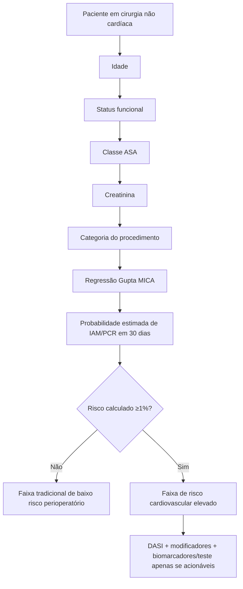

### Armadilhas

- É uma estimativa populacional; não elimina avaliação clínica.
- Procedimentos devem ser mapeados à categoria cirúrgica do modelo original com cautela.
- O corte de **1%** é utilizado pela abordagem AHA/ACC como limiar tradicional para distinguir risco baixo de risco elevado quando se usa uma calculadora perioperatória.

**Fonte primária:** Gupta PK et al. *Circulation*. 2011;124(4):381-387. PMID 21730309. DOI 10.1161/CIRCULATIONAHA.110.015701.

---

## 4. DASI — capacidade funcional estruturada

### O que responde

“Qual é a capacidade funcional autorreferida por um instrumento estruturado em vez de uma estimativa subjetiva do médico?”

O DASI contém 12 atividades ponderadas. A soma varia de **0 a 58,2**.

A AHA/ACC 2024 considera razoável usar avaliação estruturada como o DASI em cirurgia de risco elevado e usa **DASI ≤34** como definição operacional de capacidade funcional ruim no algoritmo de teste pré-operatório.

### Árvore de decisão

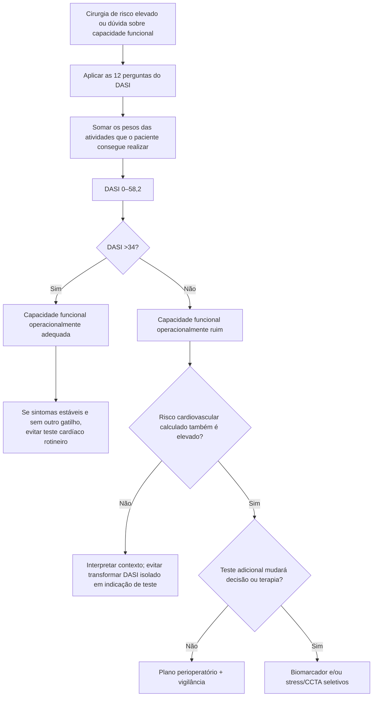

### Atualização importante de 2026

Uma análise internacional agrupada de 3.485 pacientes mostrou que o DASI acrescenta informação prognóstica além de idade, RCRI e peptídeo natriurético, mas com ganho global modesto de discriminação. O risco associado ao mesmo valor de DASI varia conforme idade, RCRI e biomarcadores.

**Implicação para a Corvia:** manter o corte **≤34** porque ele é operacional na AHA/ACC 2024, mas exibir o **valor contínuo** e uma mensagem de contexto, evitando a falsa ideia de que 33 e 35 representam pacientes biologicamente distintos.

**Fontes:**

- Hlatky MA et al. *Am J Cardiol*. 1989;64(10):651-654. PMID 2782256. DOI 10.1016/0002-9149(89)90496-7.
- Thompson A et al. AHA/ACC et al. Guideline for Perioperative Cardiovascular Management for Noncardiac Surgery. *Circulation*. 2024. DOI 10.1161/CIR.0000000000001285.
- Wijeysundera DN et al. *EClinicalMedicine*. 2026;96:104015. PMID 42326382. PMCID PMC13276150. DOI 10.1016/j.eclinm.2026.104015.

---

## 5. GSCRI — paciente geriátrico

### Quando faz sentido

O Geriatric-Sensitive Cardiac Risk Index foi desenvolvido especificamente para pacientes **≥65 anos** submetidos a cirurgia não cardíaca.

Variáveis do modelo final:

- AVC prévio;
- ASA;
- categoria cirúrgica;
- status funcional;
- creatinina >1,5 mg/dL;
- história de insuficiência cardíaca;
- diabetes, distinguindo insulinodependência.

Na validação geriátrica publicada, a AUC foi 0,76, comparada com 0,63 para RCRI e 0,70 para Gupta MICA.

### Árvore de decisão

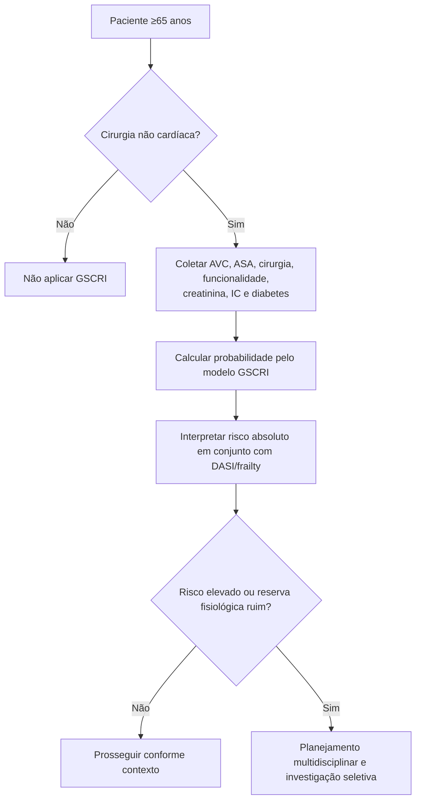

**Nota de implementação:** os coeficientes do modelo estão disponíveis no texto completo de acesso aberto, portanto o GSCRI pode ser reproduzido localmente após validação técnica independente da fórmula.

**Fonte primária:** Alrezk R et al. *J Am Heart Assoc*. 2017;6(11):e006648. PMID 29146612. PMCID PMC5721761. DOI 10.1161/JAHA.117.006648.

---

## 6. Biomarcadores — quando acrescentam informação

A AHA/ACC 2024 considera razoável medir **BNP ou NT-proBNP** antes de cirurgia de risco elevado em pacientes com doença cardiovascular conhecida, idade ≥65 anos, ou idade ≥45 anos com sintomas sugestivos de doença cardiovascular. Troponina cardíaca pré-operatória pode ser considerada no mesmo cenário.

O algoritmo da diretriz usa como valores anormais:

- troponina acima do percentil 99 do ensaio;
- BNP >92 ng/L;
- NT-proBNP ≥300 ng/L.

### Árvore de decisão

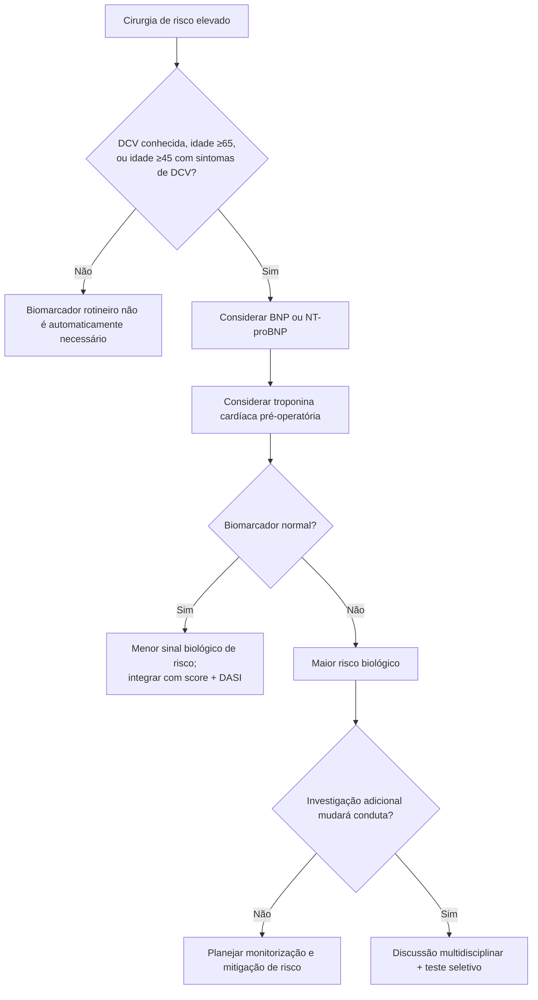

**Importante:** biomarcador anormal **não equivale automaticamente** a indicação de coronariografia ou teste de isquemia.

**Fonte:** Thompson A et al. AHA/ACC et al. *Circulation*. 2024. DOI 10.1161/CIR.0000000000001285.

---

## 7. Quando pedir ECG

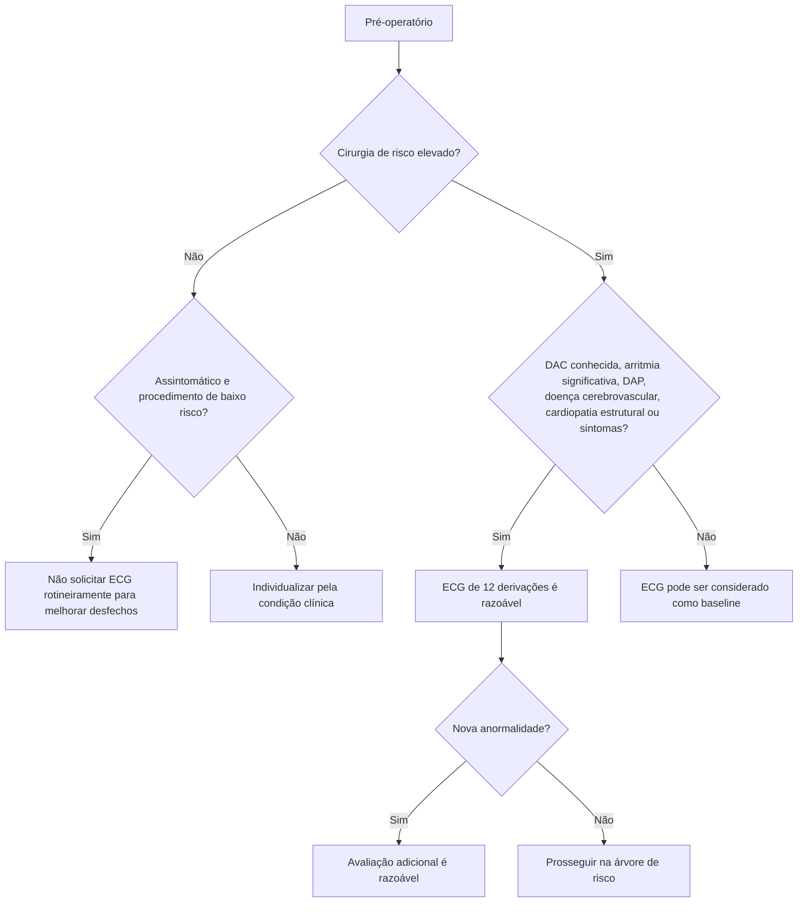

A AHA/ACC 2024 lista como sintomas/sinais ativos relevantes dor torácica, dispneia, palpitações não diagnosticadas, taquicardia, síncope e sopro.

---

## 8. Quando pedir ecocardiograma para função ventricular

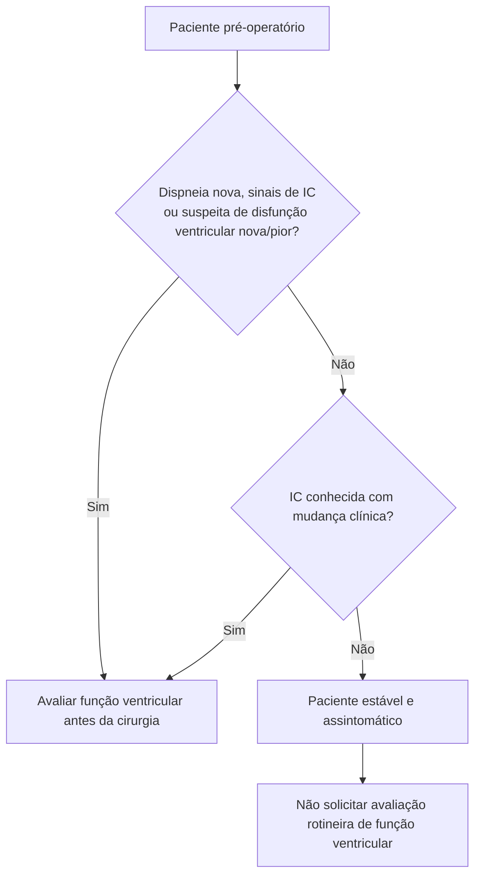

O objetivo é reduzir ecocardiogramas “de liberação” sem pergunta clínica definida.

---

## 9. Quando considerar teste de isquemia ou CCTA

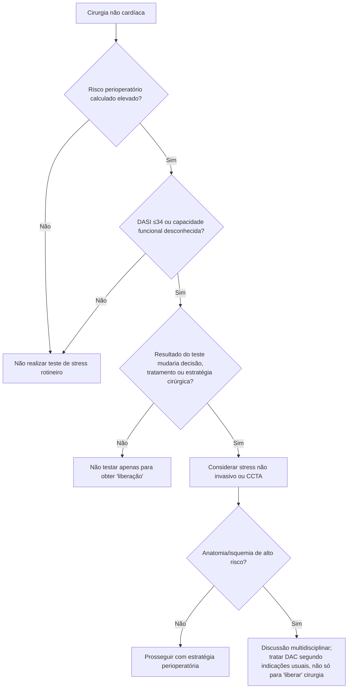

A AHA/ACC 2024 classifica teste de stress como opção **2b** em pacientes com cirurgia de risco elevado, capacidade funcional ruim/desconhecida e risco elevado por ferramenta validada. Em pacientes de baixo risco, com capacidade funcional adequada e sintomas estáveis, ou submetidos a procedimento de baixo risco, teste rotineiro não oferece benefício.

---

## 10. Fragilidade — não deixar o idoso ser reduzido a idade cronológica

A AHA/ACC 2024 considera útil avaliar fragilidade com ferramenta validada em todos os pacientes ≥65 anos — e em mais jovens com suspeita de fragilidade — quando submetidos a cirurgia de risco elevado.

### Árvore

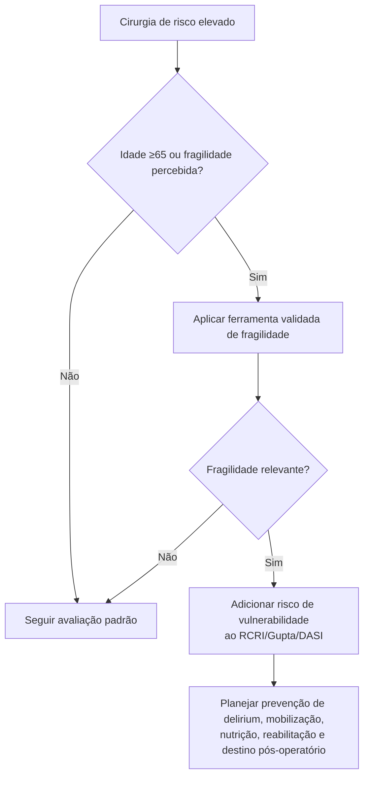

**Princípio:** fragilidade não é sinônimo de contraindicação cirúrgica; é um modificador de risco e de planejamento.

---

## 11. Como escolher o método — matriz prática

| Método | Pergunta que responde | Desfecho principal | Melhor uso | Limitação central |
|---|---|---|---|---|
| **RCRI** | Quantos fatores cardíacos clássicos estão presentes? | Complicação cardíaca maior | Triagem simples e transparente | Não inclui idade nem capacidade funcional |
| **Gupta MICA** | Qual a probabilidade individual de IAM/PCR? | IAM ou parada cardíaca em 30 dias | Risco contínuo e consentimento | Depende de categoria cirúrgica/ASA |
| **DASI** | Qual a reserva funcional autorreferida? | Capacidade funcional / prognóstico incremental | Evitar estimativa subjetiva de METs | Não deve ser usado isoladamente como “liberação” |
| **GSCRI** | Qual o risco cardíaco em ≥65 anos? | MICA | Idoso em cirurgia não cardíaca | Aplicação específica à população geriátrica |
| **AUB-HAS2** | Estratificação cardíaca perioperatória simplificada | MACE perioperatório | Alternativa validada em coortes próprias | Generalização depende da população |
| **VSG-CRI** | Risco cardíaco em cirurgia vascular | Eventos cardíacos | Cirurgia vascular | Não extrapolar para cirurgia geral |
| **ACS-NSQIP SRC** | Qual o risco global de múltiplos desfechos? | Mortalidade e complicações diversas | Planejamento cirúrgico global | Ferramenta externa; termos não permitem automação local |
| **POSPOM/SORT** | Qual o risco de mortalidade pós-operatória? | Mortalidade | Planejamento anestésico/cirúrgico global | Não são escores cardiovasculares específicos |

---

## 12. Regra de ouro da investigação pré-operatória

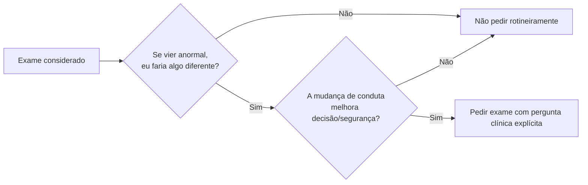

Essa regra reduz o ciclo “risco → exame → outro exame → atraso cirúrgico” sem benefício demonstrado.

---

## 13. Arquitetura recomendada para a Corvia

A tela de Avaliação Cardiológica Pré-Operatória pode exibir os resultados em cinco blocos, em vez de uma lista de scores:

### Camada 1 — Segurança imediata

- cirurgia de emergência/urgência;
- SCA;
- arritmia instável;
- insuficiência cardíaca descompensada;
- outra condição cardiovascular aguda que mude o timing.

### Camada 2 — Risco calculado

- RCRI;
- Gupta MICA;
- AUB-HAS2;
- VSG-CRI em cirurgia vascular;
- GSCRI em ≥65 anos quando implementado/validado no produto.

### Camada 3 — Reserva do paciente

- DASI contínuo;
- corte operacional DASI ≤34;
- fragilidade;
- status funcional.

### Camada 4 — Sinal biológico

- BNP/NT-proBNP;
- troponina quando indicada;
- função renal e hemoglobina como contexto.

### Camada 5 — Decisão acionável

- seguir para cirurgia;
- otimizar condição cardiovascular;
- solicitar eco;
- solicitar teste de isquemia/CCTA;
- discutir estratégia alternativa;
- planejar monitorização pós-operatória/troponina.

### Saída ideal do sistema

Em vez de “**RCRI = 2**”, a Corvia deve conseguir produzir algo como:

> **Risco cardiovascular calculado elevado + capacidade funcional reduzida.** O score isolado não determina investigação adicional. Verifique se biomarcador/teste cardíaco mudaria a estratégia cirúrgica ou o tratamento. Se não mudar, priorize otimização e plano perioperatório em vez de rastreamento indiscriminado.

Essa frase é uma síntese clínica original; não substitui recomendação formal da diretriz.

---

## 14. Fontes primárias consultadas

1. Thompson A, Fleischmann KE, Smilowitz NR, et al. 2024 AHA/ACC/ACS/ASNC/HRS/SCA/SCCT/SCMR/SVM Guideline for Perioperative Cardiovascular Management for Noncardiac Surgery. *Circulation*. 2024. DOI: 10.1161/CIR.0000000000001285.
2. Halvorsen S, Mehilli J, Cassese S, et al. 2022 ESC Guidelines on cardiovascular assessment and management of patients undergoing non-cardiac surgery. *Eur Heart J*. 2022;43:3826-3924. PMID 36017553. DOI: 10.1093/eurheartj/ehac270.
3. Lee TH, Marcantonio ER, Mangione CM, et al. *Circulation*. 1999;100:1043-1049. PMID 10477528. DOI: 10.1161/01.CIR.100.10.1043.
4. Gupta PK, Gupta H, Sundaram A, et al. *Circulation*. 2011;124:381-387. PMID 21730309. DOI: 10.1161/CIRCULATIONAHA.110.015701.
5. Hlatky MA, Boineau RE, Higginbotham MB, et al. *Am J Cardiol*. 1989;64:651-654. PMID 2782256. DOI: 10.1016/0002-9149(89)90496-7.
6. Alrezk R, Jackson N, Al Rezk M, et al. *J Am Heart Assoc*. 2017;6:e006648. PMID 29146612. PMCID PMC5721761. DOI: 10.1161/JAHA.117.006648.
7. Wijeysundera DN, Cuthbertson BH, Duceppe E, et al. *EClinicalMedicine*. 2026;96:104015. PMID 42326382. PMCID PMC13276150. DOI: 10.1016/j.eclinm.2026.104015.

---

## 15. Governança

- Nenhum fluxograma deste documento deve converter recomendação **2a/2b** em obrigação automática.
- Nenhum score deve ser usado fora da população/desfecho para o qual foi desenvolvido sem aviso explícito.
- Valores não confirmados em fonte primária devem permanecer marcados como `VERIFICAÇÃO HUMANA NECESSÁRIA`.
- As árvores são **representações educacionais próprias da Corvia**, derivadas de recomendações e estudos citados; não são reprodução gráfica das figuras protegidas das diretrizes.
