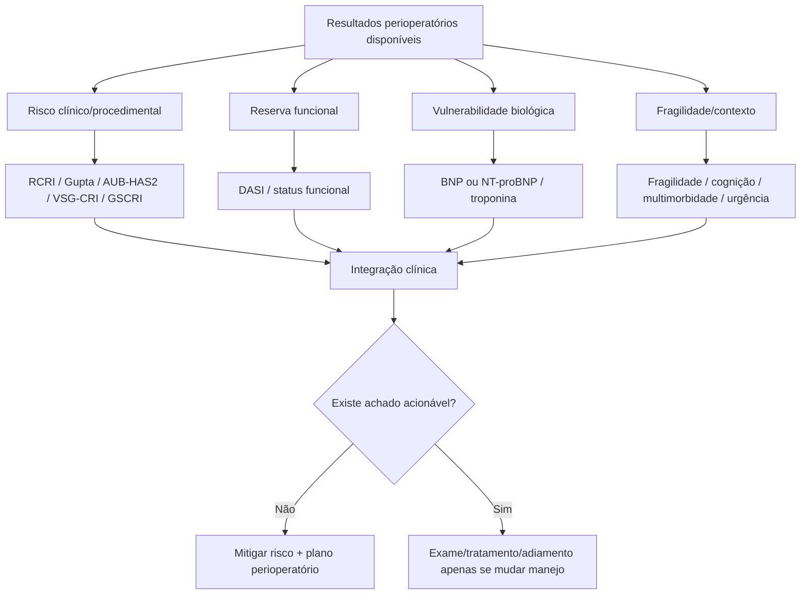
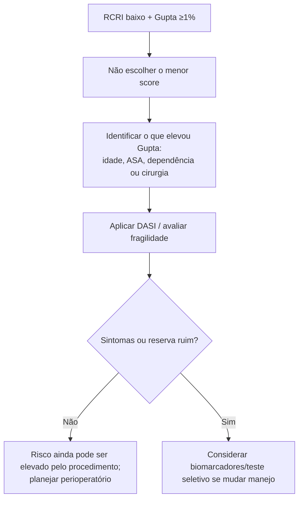
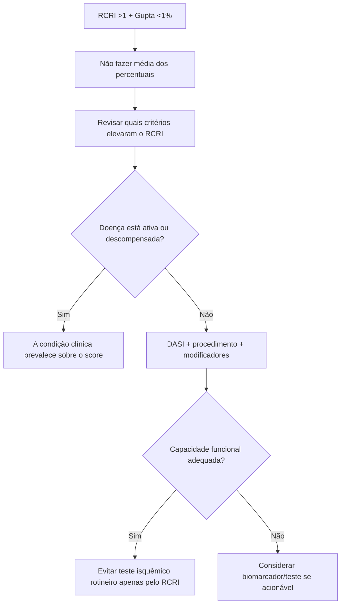
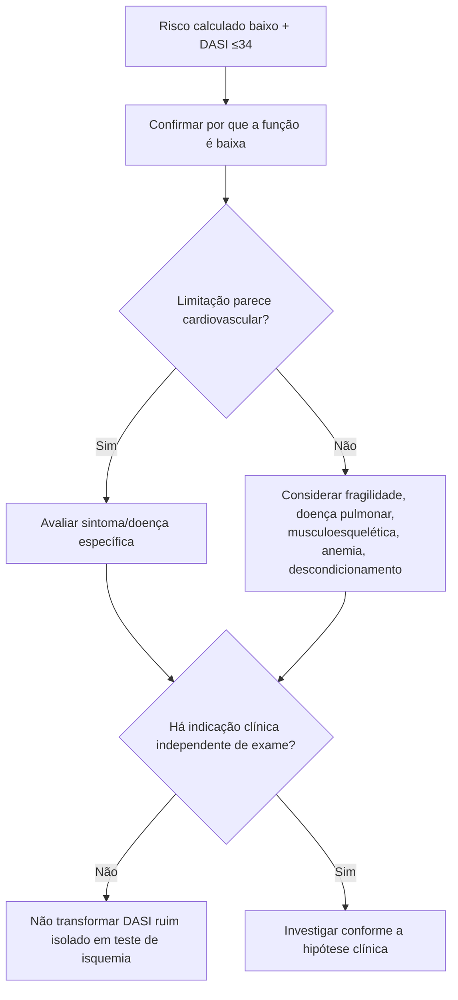
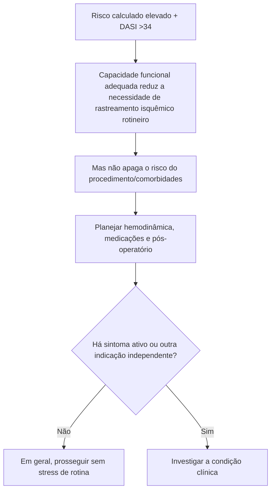
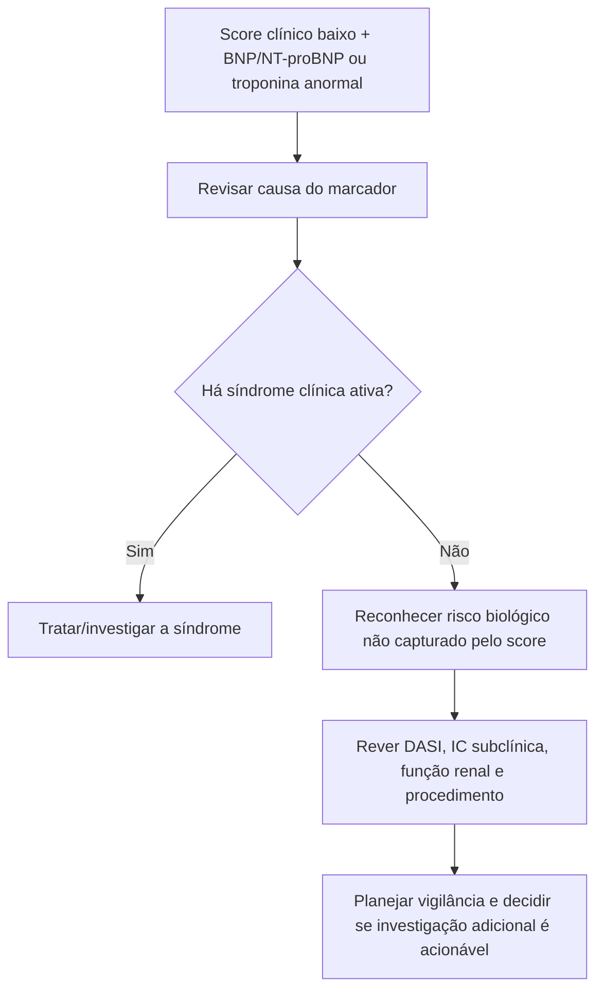
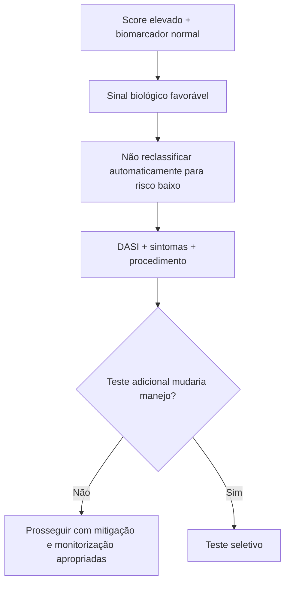
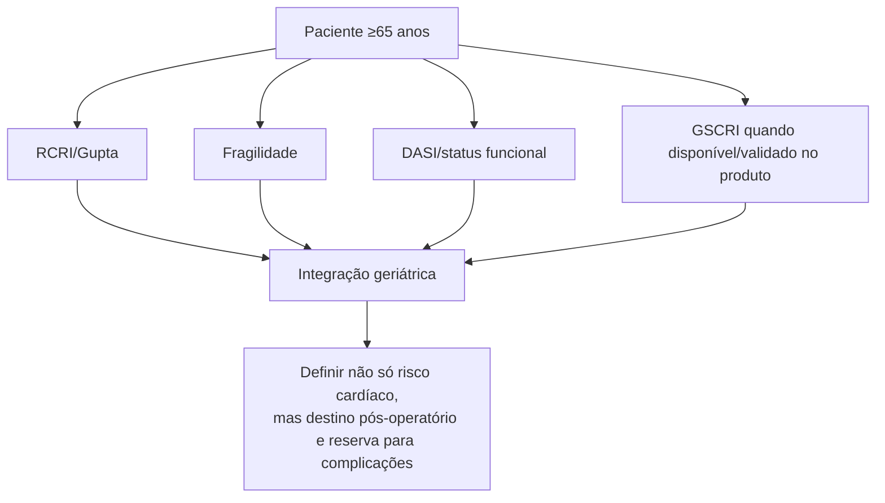
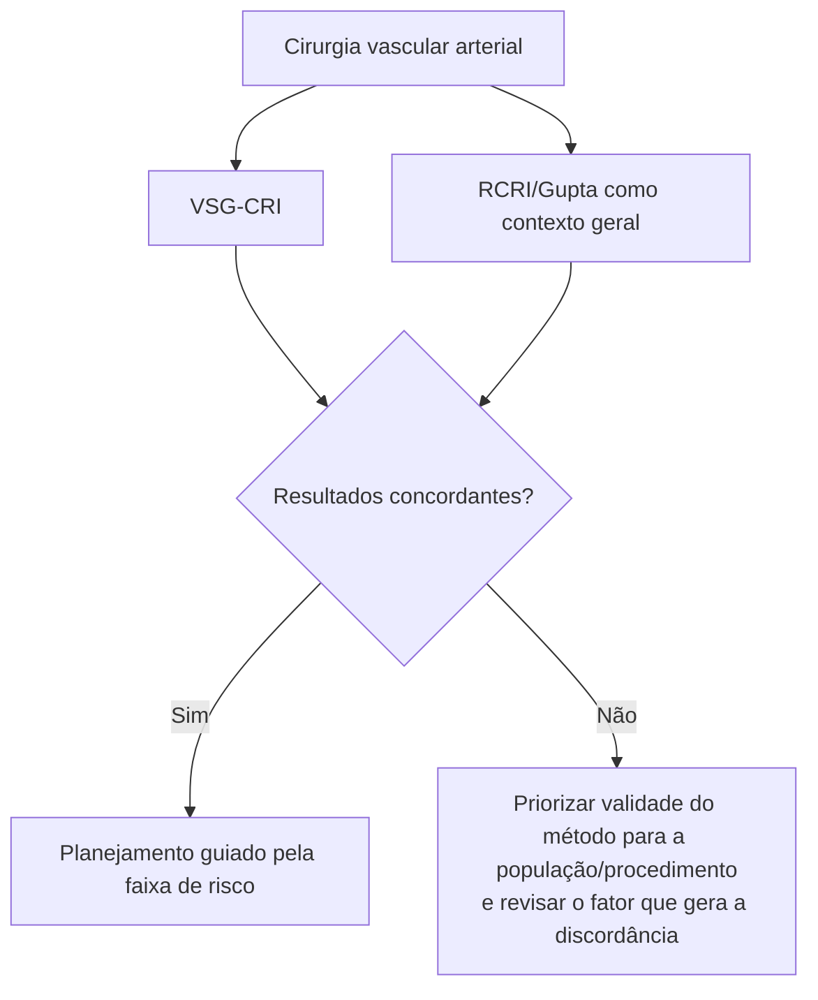
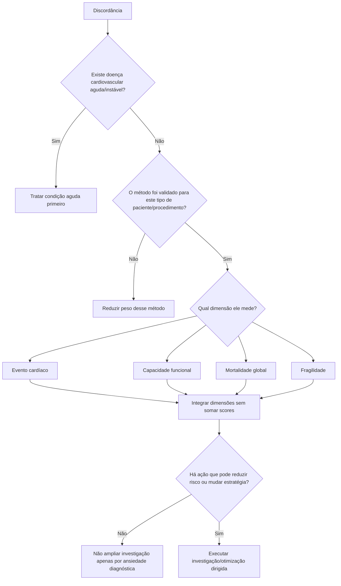

# Comparador de metodologias e resolvedor de discordância — risco perioperatório

> Metadados de produção: `{"fonte_producao":"chatgpt","frente":"documento_biblioteca","tema":"Perioperatório","revisado_por_voce":false}`
>
> Documento de síntese clínica. Não substitui as diretrizes nem transforma uma combinação de scores em um novo escore validado.

## Por que este documento existe

RCRI, Gupta MICA, DASI, AUB-HAS2, VSG-CRI, GSCRI, fragilidade e biomarcadores **não medem a mesma coisa**. Portanto, resultados discordantes são esperados e não devem ser “resolvidos” por média aritmética, votação ou escolha do score que produziu o menor risco.

A função deste documento é mostrar **qual dimensão do risco está puxando o resultado** e qual pergunta clínica vem depois.

---

## 1. O mapa mental



---

## 2. Quando RCRI e Gupta MICA discordam

### Cenário A — RCRI baixo, Gupta MICA elevado

Possíveis razões:

- idade aumenta risco no Gupta e não existe no RCRI;
- dependência funcional entra no Gupta e não no RCRI;
- classe ASA entra no Gupta;
- o tipo específico de procedimento exerce peso maior no Gupta.



**Leitura prática:** o RCRI baixo não “anula” um Gupta elevado. Ele apenas diz que os seis fatores clássicos de Lee são poucos.

---

### Cenário B — RCRI elevado, Gupta MICA baixo

Possíveis razões:

- história de DAC, AVC ou uso de insulina pode aumentar RCRI mesmo em um procedimento atual de menor estresse;
- o paciente pode ser independente, ASA mais baixo e ter categoria cirúrgica de menor risco no Gupta.



---

## 3. Score baixo, DASI ruim

Este é um dos cenários mais importantes para evitar dois erros opostos: ignorar baixa reserva ou pedir teste de isquemia automaticamente.



**Atualização 2026:** o DASI acrescenta informação prognóstica, mas sua interpretação é dependente de idade, RCRI e biomarcadores; o mesmo valor de DASI não corresponde ao mesmo risco em todos os pacientes.

---

## 4. Score elevado, DASI bom



**Ponto central:** “bom DASI” e “baixo risco” não são sinônimos.

---

## 5. Score baixo, biomarcador anormal



Um biomarcador alterado não deve ser descartado apenas porque o RCRI é 0 ou 1.

---

## 6. Score elevado, biomarcador normal



Biomarcador normal é informação adicional; não é uma “autorização cirúrgica”.

---

## 7. Idoso: RCRI/Gupta versus GSCRI e fragilidade

Em pacientes ≥65 anos, a avaliação fica especialmente vulnerável à subestimação quando se olha apenas para cardiopatia conhecida.

O GSCRI foi construído especificamente para essa população e, na validação publicada, discriminou MICA melhor que RCRI e Gupta na coorte geriátrica.



---

## 8. Cirurgia vascular: não usar escore genérico como se fosse específico

O VSG-CRI foi desenvolvido para cirurgia vascular arterial. Nesse contexto, ele pode acrescentar estratificação específica que um score geral não captura da mesma forma.



Não extrapolar VSG-CRI para cirurgia geral.

---

## 9. Regra de precedência clínica

Quando dados discordam, a ordem de prioridade não deve ser “qual score é mais famoso”.



---

## 10. Matriz de interpretação rápida

| Combinação | Leitura mais provável | Próximo passo racional |
|---|---|---|
| RCRI baixo + Gupta baixo + DASI bom | baixo sinal clínico e boa reserva | evitar investigação cardíaca rotineira se assintomático/estável |
| RCRI alto + Gupta alto | risco clínico consistente | abrir camadas DASI/biomarcadores/modificadores |
| RCRI baixo + Gupta alto | idade/ASA/procedimento/funcionalidade provavelmente puxam risco | identificar driver; não escolher RCRI por conveniência |
| RCRI alto + Gupta baixo | comorbidade clássica pesa mais que contexto atual do Gupta | revisar atividade da doença e reserva funcional |
| score baixo + DASI ruim | baixa reserva não explicada pelo score | esclarecer causa funcional; fragilidade/sintomas |
| score alto + DASI bom | boa reserva não elimina risco estrutural/procedimental | normalmente evita stress rotineiro se estável, mas exige plano |
| score baixo + biomarcador alto | risco biológico não capturado | procurar causa e reavaliar estratégia/vigilância |
| score alto + biomarcador normal | sinal biológico favorável sem zerar risco | integrar demais dimensões, sem “downgrade” automático |

---

## 11. O que NÃO fazer

- **Não somar** pontos de RCRI + AUB-HAS2 + VSG-CRI.
- **Não fazer média** entre percentuais de Gupta, GSCRI e ACS-NSQIP.
- **Não escolher retrospectivamente** o score que produz o resultado mais conveniente.
- **Não pedir teste de isquemia** apenas porque dois scores discordaram.
- **Não interpretar DASI ≤34 como diagnóstico de DAC.**
- **Não interpretar BNP/NT-proBNP elevado como indicação automática de coronariografia.**
- **Não usar VSG-CRI fora de cirurgia vascular arterial.**

---

## 12. Sugestão para o frontend da Corvia

Em vez de cinco cards independentes, mostrar uma síntese em camadas:

```text
RISCO CALCULADO
RCRI: ... | Gupta: ... | método específico: ...

RESERVA
DASI: ... | Fragilidade: ...

SINAL BIOLÓGICO
BNP/NT-proBNP: ... | Troponina: ...

DISCORDÂNCIA
[explicação automática do principal driver]

PRÓXIMO PASSO
[prosseguir / otimizar / investigar sintoma / considerar biomarcador / considerar teste se mudar manejo]
```

A mensagem automática deve explicar **por que** os métodos discordam, não decretar “apto” ou “inapto”.

---

## Fontes principais

- Thompson A et al. 2024 AHA/ACC/ACS/ASNC/HRS/SCA/SCCT/SCMR/SVM Guideline for Perioperative Cardiovascular Management for Noncardiac Surgery. *Circulation*. 2024. DOI 10.1161/CIR.0000000000001285.
- Halvorsen S et al. 2022 ESC Guidelines on cardiovascular assessment and management of patients undergoing non-cardiac surgery. *Eur Heart J*. 2022;43:3826-3924. PMID 36017553. DOI 10.1093/eurheartj/ehac270.
- Lee TH et al. *Circulation*. 1999;100:1043-1049. PMID 10477528. DOI 10.1161/01.CIR.100.10.1043.
- Gupta PK et al. *Circulation*. 2011;124:381-387. PMID 21730309. DOI 10.1161/CIRCULATIONAHA.110.015701.
- Hlatky MA et al. *Am J Cardiol*. 1989;64:651-654. PMID 2782256. DOI 10.1016/0002-9149(89)90496-7.
- Alrezk R et al. *J Am Heart Assoc*. 2017;6:e006648. PMID 29146612. PMCID PMC5721761. DOI 10.1161/JAHA.117.006648.
- Wijeysundera DN et al. *EClinicalMedicine*. 2026;96:104015. PMID 42326382. PMCID PMC13276150. DOI 10.1016/j.eclinm.2026.104015.
