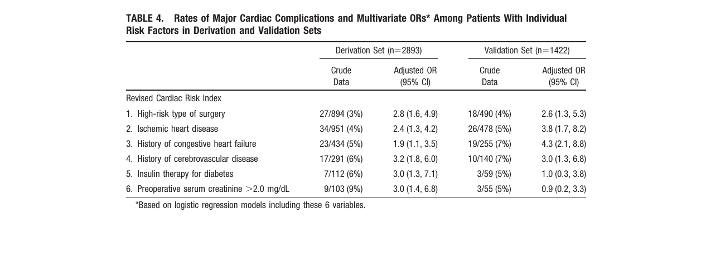
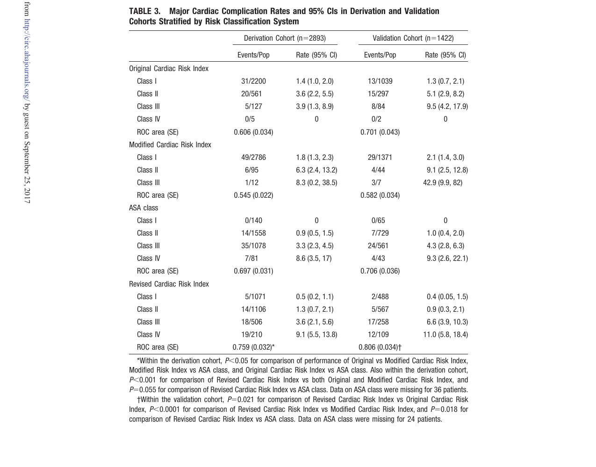
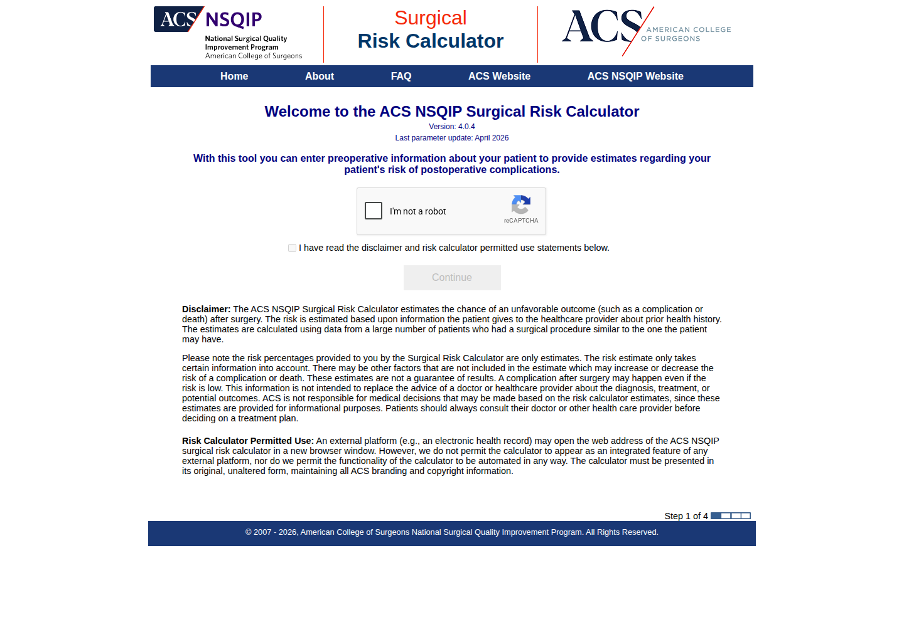

# Avaliação Cardiológica Pré-Operatória — hub científico e visual

> Metadados de produção: `{"fonte_producao":"chatgpt","frente":"documento_biblioteca","tema":"Perioperatório","revisado_por_voce":false}`
>
> Este diretório deixou de ser apenas um depósito de screenshots. Ele passa a funcionar como **camada de auditoria + atlas de decisão** da Avaliação Cardiológica Pré‑Operatória da Corvia.

## Comece aqui

### 🧭 [Atlas visual de decisão perioperatória](ATLAS_DECISAO.md)

O atlas contém árvores Mermaid renderizadas diretamente no GitHub para:

- Risk Stack perioperatório completo;
- RCRI;
- Gupta MICA;
- DASI;
- GSCRI no paciente ≥65 anos;
- biomarcadores;
- indicação de ECG;
- indicação de ecocardiograma;
- stress/CCTA;
- fragilidade;
- escolha entre metodologias;
- regra “o exame mudará conduta?”.

A proposta é que essas árvores sirvam de **referência clínica, especificação funcional para o frontend e material educacional**, sem copiar as figuras das diretrizes.

---

## A ideia central: score não é avaliação pré-operatória

A Corvia já possui calculadoras perioperatórias. O passo seguinte é interpretá-las em camadas:

Esse desenho é deliberado: um RCRI ou Gupta alto **abre uma árvore de raciocínio**; não cria automaticamente indicação de teste de isquemia.

---

## O que já existe na Corvia

A implementação atual já contempla:

| Método | Situação no produto | Papel |
|---|---|---|
| **RCRI** | calculadora interativa | complicação cardíaca maior |
| **Gupta MICA** | calculadora interativa | IAM/PCR perioperatório |
| **DASI** | calculadora interativa | capacidade funcional estruturada |
| **AUB-HAS2** | calculadora interativa | estratificação cardiovascular perioperatória |
| **VSG-CRI** | calculadora interativa | cirurgia vascular |
| **GSCRI** | documentado | risco cardíaco geriátrico; fórmula primária aberta permite futura implementação local validada |
| **ACS-NSQIP SRC** | documentado/externo | risco cirúrgico global; não automatizar contra os termos da ferramenta |

Além disso, cada calculadora está ligada à Biblioteca e pode gerar laudo individual.

---

## Upgrade clínico que o Atlas introduz

### 1. DASI não será tratado como um simples “sim/não”

A AHA/ACC 2024 usa **DASI ≤34** como definição operacional de capacidade funcional ruim no algoritmo de teste pré-operatório. Entretanto, estudo internacional publicado em 2026 mostrou que o valor prognóstico do DASI varia conforme idade, RCRI e peptídeos natriuréticos.

**Direção para a Corvia:** mostrar simultaneamente:

- valor contínuo 0–58,2;
- interpretação operacional em relação a 34;
- aviso de que o risco final depende do contexto clínico.

### 2. Biomarcadores entram como nova camada, não como novo “score”

No algoritmo AHA/ACC 2024, em cirurgia de risco elevado, BNP/NT-proBNP pode acrescentar informação em pacientes selecionados. Os limiares usados na figura da diretriz são:

- troponina > percentil 99 do ensaio;
- BNP >92 ng/L;
- NT-proBNP ≥300 ng/L.

Um resultado anormal deve **refinar o risco**, e não disparar coronariografia automaticamente.

### 3. O sistema precisa responder “o que faço com este resultado?”

O output ideal deixa de ser:

> RCRI = 2.

E passa a ser algo como:

> **Risco cardiovascular calculado elevado.** Avalie reserva funcional e modificadores. Se a capacidade funcional for ruim/desconhecida, considere biomarcadores e investigação cardíaca apenas quando o resultado puder modificar o tratamento, o tipo/timing da cirurgia ou o plano perioperatório.

---

## Fontes centrais já validadas para o atlas

### Diretrizes

- **AHA/ACC et al. 2024** — Thompson A et al. *Circulation*. DOI `10.1161/CIR.0000000000001285`.
- **ESC 2022** — Halvorsen S et al. *Eur Heart J*. 2022;43:3826-3924. PMID `36017553`. DOI `10.1093/eurheartj/ehac270`.

### Escores e capacidade funcional

- **RCRI** — Lee TH et al. *Circulation*. 1999;100:1043-1049. PMID `10477528`. DOI `10.1161/01.CIR.100.10.1043`.
- **Gupta MICA** — Gupta PK et al. *Circulation*. 2011;124:381-387. PMID `21730309`. DOI `10.1161/CIRCULATIONAHA.110.015701`.
- **DASI** — Hlatky MA et al. *Am J Cardiol*. 1989;64:651-654. PMID `2782256`. DOI `10.1016/0002-9149(89)90496-7`.
- **GSCRI** — Alrezk R et al. *J Am Heart Assoc*. 2017;6:e006648. PMID `29146612`. PMCID `PMC5721761`. DOI `10.1161/JAHA.117.006648`.
- **DASI — atualização 2026** — Wijeysundera DN et al. *EClinicalMedicine*. 2026;96:104015. PMID `42326382`. PMCID `PMC13276150`. DOI `10.1016/j.eclinm.2026.104015`.

---

# Arquivo de auditoria das fontes originais

As imagens abaixo continuam preservadas porque servem para **conferência visual da fonte primária**. Elas não são as árvores clínicas da Corvia.

## RCRI — Lee 1999

PDF de acesso aberto usado para conferência visual:

https://cloudfront.escholarship.org/dist/prd/content/qt845640mb/qt845640mb.pdf

### Tabela original — seis preditores

### Tabela original — classes e taxas de evento

---

## ACS-NSQIP Surgical Risk Calculator

Foi possível registrar apenas a tela inicial da ferramenta oficial. Os próprios termos do ACS-NSQIP proíbem automatização da calculadora e a aplicação possui CAPTCHA; portanto a Corvia **não deve reproduzir, raspar ou automatizar o serviço externo** sem autorização/licenciamento apropriado.

---

## Fontes que antes pareciam “bloqueadas”, mas hoje já possuem dados suficientes por outras rotas oficiais

O levantamento original registrava 403/paywall para AHA/ACC 2024, ESC 2022, Gupta MICA e DASI. Isso era uma limitação de **um caminho de acesso**, não ausência de evidência verificável.

Desde então foram localizadas/validadas rotas independentes:

- slide set oficial da AHA/ACC 2024;
- texto completo online da ESC 2022;
- registro PubMed do Gupta MICA;
- registro PubMed do DASI original;
- PMC aberto do GSCRI;
- PMC/PubMed do estudo internacional do DASI publicado em 2026.

Por isso o estado científico atual está consolidado no [Atlas de Decisão](ATLAS_DECISAO.md), enquanto esta seção permanece como histórico de auditoria.

---

## Próximas expansões de maior valor

Em vez de acumular dezenas de scores sem hierarquia, a prioridade recomendada é:

1. **Integrador visual de risco** — apresentar simultaneamente risco calculado, DASI, biomarcador e modificadores.
2. **Árvore automática de investigação** — ECG/eco/stress/CCTA conforme pergunta clínica e diretriz.
3. **GSCRI interativo** em pacientes ≥65 anos após validação independente do cálculo contra a tabela aberta.
4. **Fragilidade** como modificador de risco em cirurgia de risco elevado.
5. **Vigilância pós-operatória** baseada no risco pré-operatório, incluindo estratégia de troponina quando indicada.
6. **Comparador de metodologias** mostrando por que RCRI, Gupta, AUB-HAS2, VSG-CRI e GSCRI podem discordar.

O objetivo final não é ter “mais scores”. É fazer a Corvia explicar **por que o paciente é de risco e qual é o próximo passo racional**.
