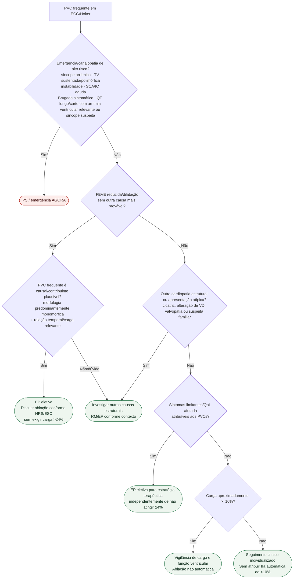

# Fluxograma: sinalizadores ambulatoriais de PVC frequente

**Aplicação em adultos.** Crianças e adolescentes exigem [via pediátrica](/biblioteca/extrassistoles-ventriculares-e-supraventriculares-na-crianca-e-no-adolescente-limiar-de-carga-historia-natural-e-tratamento); não extrapolar cortes de carga de adultos.

## Notas
- Baman >24% é discriminador de coorte, não requisito para ablação.
- Sintomas relevantes podem justificar EP mesmo com VE preservado e carga 10–24%.
- Monomorfismo é modificador de causalidade/viabilidade da ablação, não gatilho isolado.

FEVE preservada não exclui cicatriz, cardiomiopatia do VD ou valvopatia: achados estruturais/atípicos exigem investigação e RM quando indicada antes de atribuir baixo risco. Evento remoto sem instabilidade atual requer avaliação especializada célere, sem tornar toda história prévia uma emergência. Sintomas leves inespecíficos isolados em padrão de Brugada não equivalem a síncope arrítmica.
