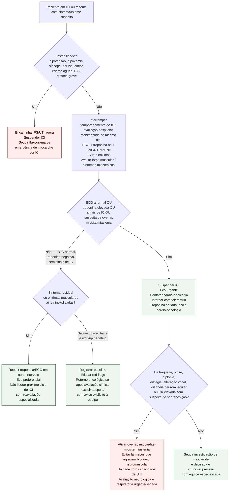

# Fluxograma: suspeita ambulatorial de miocardite por inibidor de checkpoint

Miocardite por inibidor de checkpoint imunológico (ICI) é incomum, mas a mortalidade relatada é alta quando grave. No ambulatório o erro clássico é atribuir cansaço ao câncer ou à anemia e mandar o paciente 'voltar na próximo ciclo'. Este fluxograma cobre a **porta ambulatorial**; o manejo de emergência/UTI está em documento separado desta biblioteca.

A ESC 2022 reconhece critérios diagnósticos próprios para miocardite por ICI (maiores/menores e via histopatológica). Aqui a ênfase é **triagem e escalonamento**, não substituir o algoritmo diagnóstico completo.

## Red flags ambulatoriais sob ICI (ou semanas após a última dose)

- dor torácica, dispneia, ortopneia, síncope, palpitações;
- fadiga abrupta desproporcional;
- sinais de IC nova;
- mialgia intensa, fraqueza proximal, ptose, diplopia, disfagia, alteração vocal ou dispneia neuromuscular — pensar overlap **miocardite–miosite–miastenia**;
- elevação inexplicada de CK, AST/ALT ou LDH em exames de rotina oncológica (podem ser a primeira pista).

## Fluxograma ambulatorial

## Condutas-chave (ambulatorial)

1. **Não aplicar o próximo ciclo de ICI** até esclarecer suspeita razoável.
2. **Troponina negativa uma vez não encerra** se o sintoma persiste — repita e faça eco.
3. **Overlap** muda o risco: trate como emergência neurológico-cardíaca até prova em contrário.
4. Imunossupressão (corticoide e escalonamentos) é decisão especializada após estratificar gravidade — este fluxograma não protocola doses.
5. Rechallenge de ICI após miocardite é exceção documentada em frameworks específicos; não decidir no corredor do ambulatório.

## Relação com outros documentos desta pasta

- Fluxograma / texto de **miocardite por ICI em emergência**;
- Overlap miocardite–miosite–miastenia;
- Biomarcadores não cardíacos de rotina (CK, AST, ALT, LDH) na vigilância;
- Estratificação HFA-ICOS e miocardite por checkpoint.

## Mensagem de bolso

No ambulatório sob ICI: **sintoma cardiovascular ou enzima muscular nova → ECG + troponina no mesmo dia; se positivo ou dúvida, suspender ICI e acionar cardio-oncologia**. Estabilidade hemodinâmica não autoriza 'esperar o próximo retorno'.

## Interpretação e segurança

CK, AST/ALT e LDH isoladas são inespecíficas; não diagnosticam miocardite. Troponina T pode aumentar em miosite, e troponina I pode ajudar a distinguir lesão cardíaca, integrada a sintomas, ECG e imagem. Troponina negativa única ou RMC normal precoce não excluem miocardite por ICI. Considerar biópsia endomiocárdica se diagnóstico incerto ou gravidade exige, por equipe especializada. Suspeita razoável exige interrupção imediata do ICI e avaliação hospitalar monitorizada; instabilidade exige emergência imediata. Avaliar sobreposição miastênica e risco ventilatório urgentemente; não manter overlap em seguimento ambulatorial. Decisão definitiva sobre suspensão/rechallenge é multidisciplinar.

## Conteúdo CorVIA conectado

- [Miocardite por inibidor de checkpoint imune: emergência ESC 2025](/biblioteca/miocardite-por-inibidor-de-checkpoint-imune-emergencia-esc-2025)
- [Sobreposição de miocardite, miosite e miastenia por ICI](/biblioteca/overlap-miocardite-miosite-miastenia-por-ici)
- [Biomarcadores musculares na vigilância por checkpoint](/biblioteca/biomarcadores-nao-cardiacos-de-rotina-ck-ast-alt-ldh-na-vigilancia-da-miocardite-por-checkpoint)
Quando miocardite por ICI é considerada provável, a equipe deve iniciar tratamento prontamente conforme protocolo especializado; não aguardar confirmação tardia por RMC ou biópsia para tratar uma apresentação grave.
