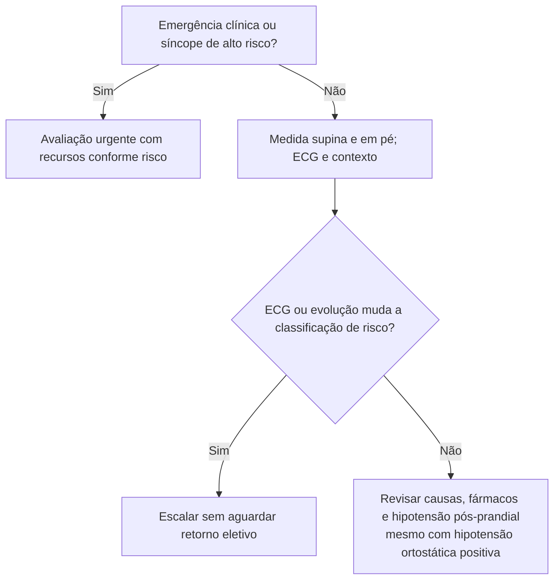

# Fluxograma ambulatorial: hipotensão ortostática no idoso — PS agora vs. retorno precoce

Consulte o protocolo de sinalizadores do mesmo pacote para critérios e limites. Reavalie o destino após exames e diante de qualquer piora.

## Navegação

- [`sinalizadores-ambulatoriais-hipotensao-ortostatica-idoso-quando-encaminhar`](/biblioteca/sinalizadores-ambulatoriais-hipotensao-ortostatica-idoso-quando-encaminhar)
- [`quedas-farmacos-cv-ortostatismo-idoso-quando-encaminhar-ambulatorial`](/biblioteca/quedas-farmacos-cv-ortostatismo-idoso-quando-encaminhar-ambulatorial)
- [`sincope-e-queda-no-idoso-estratificacao-de-risco-na-emergencia`](/biblioteca/sincope-e-queda-no-idoso-estratificacao-de-risco-na-emergencia)
