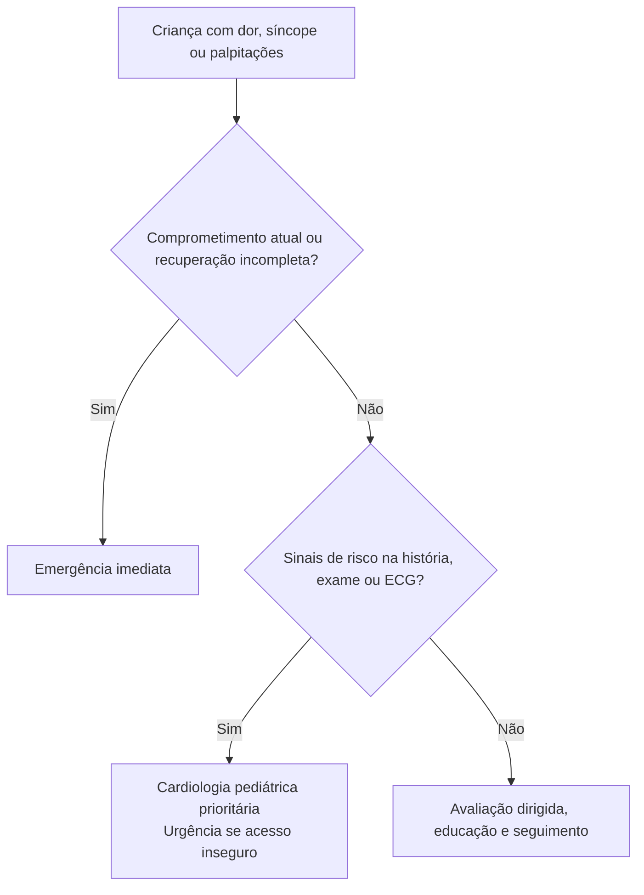

# Fluxograma: Dor, síncope e palpitações na criança: destino

## Aplicação

Aplicar os critérios do protocolo irmão antes de escolher o ramo. Estabilidade atual, evolução e acesso determinam o prazo; o fluxograma não estabelece doses nem substitui o algoritmo específico.

## Navegação

- [`sinalizadores-ambulatoriais-pediatria-dor-sincope-palpitacoes-ps-vs-especialista`](/biblioteca/sinalizadores-ambulatoriais-pediatria-dor-sincope-palpitacoes-ps-vs-especialista)
- [`palpitacoes-ambulatoriais-na-crianca-quando-ps-vs-cardiologista-pediatrico`](/biblioteca/palpitacoes-ambulatoriais-na-crianca-quando-ps-vs-cardiologista-pediatrico)
