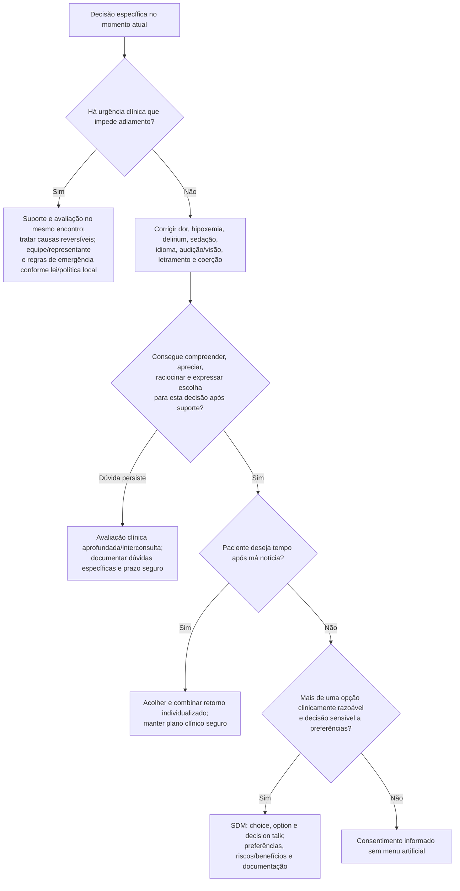

# Fluxograma ambulatorial: capacidade, SDM e má notícia — destino

Prosa: [sinalizadores-ambulatoriais-capacidade-e-sdm-no-consultorio-cardiologico](/biblioteca/sinalizadores-ambulatoriais-capacidade-e-sdm-no-consultorio-cardiologico). Checklist: [checklist-ambulatorial-capacidade-consentimento-consulta-cardiologica](/biblioteca/checklist-ambulatorial-capacidade-consentimento-consulta-cardiologica). SPIKES (estrutura completa): [fluxograma-protocolo-spikes-mas-noticias-cardiologia](/biblioteca/fluxograma-protocolo-spikes-mas-noticias-cardiologia).

## Árvore de decisão

## Interpretação da capacidade

Capacidade é específica para a decisão e o momento, não um rótulo global. Os quatro eixos orientam avaliação; uma resposta inadequada em checklist breve não comprova incapacidade. Antes de concluir, corrigir dor, hipoxemia, delirium, sedação, idioma, audição/visão, informação insuficiente, letramento, ansiedade, pressa ou coerção.

Recusa, opção de maior risco, emoção intensa ou mudança de escolha não significam incapacidade. Apreciar é aplicar a informação ao próprio caso, não concordar com a equipe. Explorar valores e informações novas; acompanhante participa conforme desejo do paciente capaz. Suspeita de violência/coerção exige proteção institucional.

Na urgência, não agendar retorno para resolver capacidade: prestar suporte, tratar causas reversíveis e escalar equipe, representante e exceções de emergência conforme lei e política local. Capacidade clínica difere de competência legal; este roteiro não estabelece regra jurídica universal.
