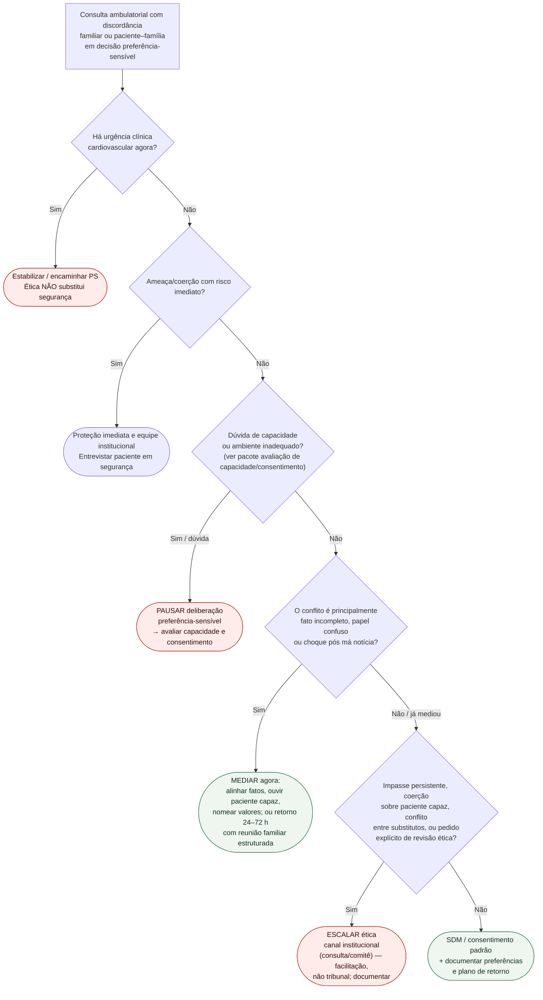

# Fluxograma ambulatorial: discordância familiar — destino

Prosa: [sinalizadores-ambulatoriais-discordancia-familiar-escalada-etica-cardiologia](/biblioteca/sinalizadores-ambulatoriais-discordancia-familiar-escalada-etica-cardiologia). Checklist: [checklist-ambulatorial-discordancia-familiar-quando-escalar-etica](/biblioteca/checklist-ambulatorial-discordancia-familiar-quando-escalar-etica). Capacidade/SDM: [documentacao-de-decisao-compartilhada-e-consentimento-informado-no-prontuario-e-litigio-em-cardiologia](/biblioteca/documentacao-de-decisao-compartilhada-e-consentimento-informado-no-prontuario-e-litigio-em-cardiologia).

## Árvore de decisão

## Notas

- **D0** = segurança clínica primeiro.
- **D1** = não confundir discordância familiar com incapacidade (avaliação de capacidade/consentimento).
- **D2** = mediação alinhada a DuVal (conflito/família difícil) e Aulisio (facilitação).
- **D3** = escalada quando mediação esgota ou há coerção/impasse — Schneiderman mostra utilidade da consulta ética em conflitos de valor (contexto UTI; extrapolação operacional).
- Não decide incapacidade legal, substituto, doses nem teach-back.

## Autonomia, capacidade e proteção

Capacidade é específica para esta decisão e para este momento: avaliar compreensão, apreciação das consequências, raciocínio e expressão de escolha; oferecer comunicação acessível e corrigir causas reversíveis. Discordar da equipe ou da família não prova incapacidade. Coerção compromete a voluntariedade e requer conversa protegida, sem presumir incapacidade cognitiva.

A escolha informada e voluntária do paciente capaz prevalece; familiares participam com seu consentimento. Se faltar capacidade, identificar representação conforme normas locais e buscar preferências prévias confiáveis. Quando desconhecidas e não inferíveis com segurança, usar melhor interesse, considerando benefícios, ônus e valores disponíveis; não inventar vontade anterior. Ética apoia conflitos e casos sem representante, sem substituir proteção imediata contra ameaça/abuso nem retardar cuidado urgente. O prazo de 24–72 h só vale quando a espera for clinicamente segura.
