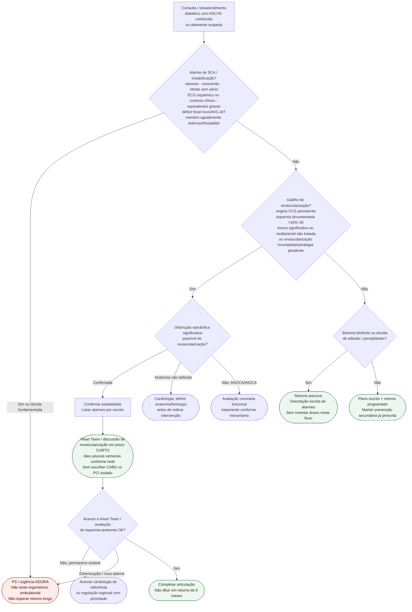

# Fluxograma ambulatorial: ASCVD no diabetes — destino de encaminhamento

Prosa: [sinalizadores-ambulatoriais-ascvd-no-diabetes-quando-encaminhar](/biblioteca/sinalizadores-ambulatoriais-ascvd-no-diabetes-quando-encaminhar) · [angina-ccs-persistente-no-diabetes-quando-discutir-revascularizacao](/biblioteca/angina-ccs-persistente-no-diabetes-quando-discutir-revascularizacao).

Não substitui a avaliação de lesão de órgão-alvo, IC/FA, hipoglicemia ou eventos adversos de iSGLT2/GLP-1, FREEDOM detalhado nem vias hospitalares de SCA.

## Árvore de decisão

## Notas

- **D1** = gate de segurança SCA (ESC 2024 CCS / ESC 2023 diabetes).
- **D2** = gatilho de revascularização ambulatorial (angina persistente, isquemia >10% VE, multiarterial — ESC 2023 + FREEDOM/Heart Team).
- **D3–D4** = limítrofe vs estável; prazos curtos são operacionais de rede.
- **Não decide** doses, SCORE2, rastreio IC/FA, alarmes iSGLT2 nem a escolha final CABG vs PCI.

## Qualificação do destino

Angina persistente ou isquemia extensa exige reavaliação, mas revascularização requer obstrução epicárdica significativa, passível de tratamento. Se a anatomia não foi definida, encaminhar à cardiologia para investigação; se não houver obstrução relevante, seguir [ANOCA/INOCA](/biblioteca/anoca-inoca-angina-e-isquemia-sem-obstrucao-coronariana-esc-2024), sem indicar PCI/CABG por sintomas isolados.

Tronco de coronária esquerda significativo é gatilho próprio de avaliação prioritária, mesmo sem alto SYNTAX. Multiarterial já completamente revascularizada e clinicamente controlada não obriga nova discussão; a prioridade se aplica a doença não tratada, incompleta ou com estratégia pendente. Avaliar a indicação primeiro; decidir PCI/CABG depois, por anatomia, risco, preferências e Heart Team.

Falta de acesso, mantendo estabilidade, exige contato com cardiologia de referência ou regulação regional e plano de acompanhamento. Novo alarme muda o destino para urgência. Prazos em dias/semanas são operacionais e se ajustam ao risco; não são espera obrigatória. Déficit neurológico focal agudo, mesmo transitório, ou isquemia aguda de membro não seguem a fila coronariana eletiva.
