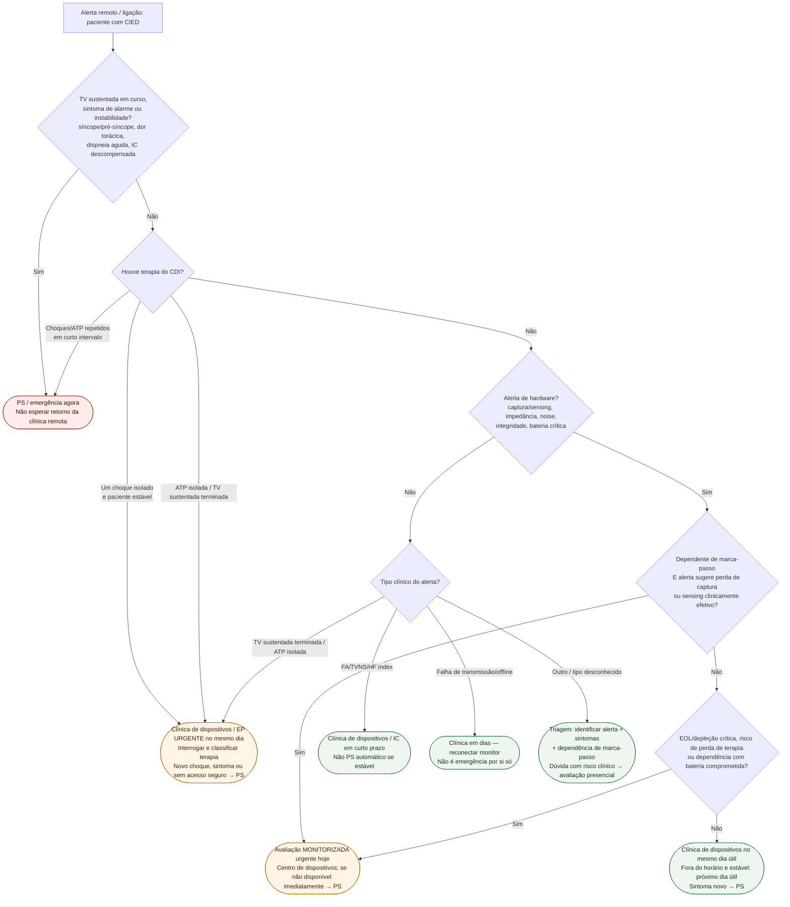

# Fluxograma: alerta remoto de CIED no ambulatório — destino

Prosa: [alerta-remoto-de-cied-no-ambulatorio-quando-ligar-clinica-vs-ps](/biblioteca/alerta-remoto-de-cied-no-ambulatorio-quando-ligar-clinica-vs-ps). Premissa: [monitoramento-remoto-nao-e-servico-de-emergencia-24h](/biblioteca/monitoramento-remoto-nao-e-servico-de-emergencia-24h). Fluxos canônicos: [fluxograma-disfuncao-de-eletrodo-fratura-e-falha-de-isolamento-conduta](/biblioteca/fluxograma-disfuncao-de-eletrodo-fratura-e-falha-de-isolamento-conduta) e [fluxograma-choque-inapropriado-de-cdi-investigacao-e-manejo](/biblioteca/fluxograma-choque-inapropriado-de-cdi-investigacao-e-manejo).

## Árvore de decisão

## Notas

- **D1**: sintoma/instabilidade prevalece sobre qualquer classificação remota.
- **D2**: choque isolado estável não é equivalente a terapias repetidas/tempestade; ainda exige avaliação rápida do dispositivo.
- **D3A**: dependência de marca-passo muda a urgência quando há suspeita de perda de captura/sensing.
- **D4**: alerta de FA/TVNS/HF index assintomático exige avaliação dirigida, não ida automática ao PS; DOT-HF (PMID 21931078) é um freio contra intervenção baseada apenas no alerta de impedância.
- O fluxo não decide reprogramação, anticoagulação, extração de eletrodo, doses ou terapias antiarrítmicas.

**TV sustentada já terminada espontaneamente ou por ATP isolada** exige contato urgente com dispositivos/EP no mesmo dia para revisar o episódio; arritmia em curso, recorrência ou sintomas mudam para emergência. **Bateria/ERI/EOL:** classificar pelo fabricante, tempo restante, dependência e eficácia das terapias. ERI isolada não é PS automático, mas EOL/depleção crítica com risco de perda de estimulação/terapia requer avaliação monitorizada imediata. Se a avaliação urgente não estiver disponível, usar PS. FA detectada exige confirmar eletrogramas/carga e avaliar risco antes de anticoagular; alerta de IC isolado não determina diurético.
