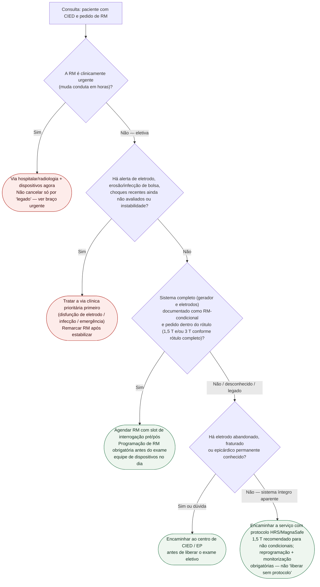

# Fluxograma: pré-RM com CIED no ambulatório — destino

Prosa: [`checklist-ambulatorial-pre-rm-em-portador-de-cied-destino`](/biblioteca/checklist-ambulatorial-pre-rm-em-portador-de-cied-destino). Braço urgente: [`rm-urgente-em-portador-de-cied-quando-nao-esperar-o-centro`](/biblioteca/rm-urgente-em-portador-de-cied-quando-nao-esperar-o-centro). Evidência: [`ressonancia-magnetica-em-pacientes-com-marcapasso-ou-cdi-nao-condicional-o-registro-magnasafe`](/biblioteca/ressonancia-magnetica-em-pacientes-com-marcapasso-ou-cdi-nao-condicional-o-registro-magnasafe).

## Árvore de decisão

## O que a árvore não decide

- Modo de estimulação (DOO/VOO vs ODO) no dia do exame.
- Se desligar ou não terapias de CDI minuto a minuto.
- Se 3 T é aceitável no caso concreto.
- Extração de eletrodo abandonado só para viabilizar RM.

Essas decisões ficam com o centro de dispositivos e com a radiologia sob o consenso HRS (PMID 28502708).

## Lembrete de evidência

Segurança em legado a 1,5 T foi demonstrada **com protocolo** (MagnaSafe PMID 28225684; Nazarian PMID 29281579). O ramo “legado íntegro” ainda exige **serviço preparado**, não alta com “pode fazer RM em qualquer clínica”.

## Segurança do processo (SCMR 2024)

Em todo sistema: interrogar antes/depois, programar modo apropriado por equipe de dispositivos, monitorizar e garantir pessoal/equipamento de resposta. Dependência orienta estratégia de estimulação; o ambulatório geral não escolhe DOO/VOO. Em CDI/TRC-D, desativar terapias de taquicardia durante exame e restaurá-las obrigatoriamente após. RM urgente não é PS automaticamente: a doença subjacente define emergência; organizar hospital/radiologia e equipe de CIED sem substituir RM clinicamente superior por TC apenas pela etiqueta do aparelho.

[Disfunção de eletrodo](/biblioteca/fluxograma-disfuncao-de-eletrodo-fratura-e-falha-de-isolamento-conduta) · [Choque inapropriado de CDI](/biblioteca/fluxograma-choque-inapropriado-de-cdi-investigacao-e-manejo).
