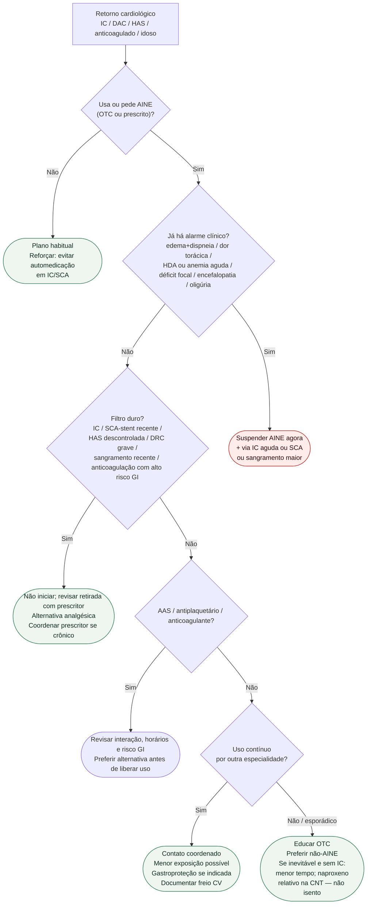

# Fluxograma ambulatorial: AINE — quando evitar e escalar

Prosa: [sinalizadores-ambulatoriais-de-aine-no-paciente-cardiologico](/biblioteca/sinalizadores-ambulatoriais-de-aine-no-paciente-cardiologico). Checklist: [checklist-ambulatorial-aine-no-retorno-cardiologico](/biblioteca/checklist-ambulatorial-aine-no-retorno-cardiologico). Magnitude CNT: [anti-inflamatorios-nao-esteroidais-aines-e-risco-cardiovascular-metanalise-cnt](/biblioteca/anti-inflamatorios-nao-esteroidais-aines-e-risco-cardiovascular-metanalise-cnt).

## Árvore de decisão

## Notas

- **D1**: ESC HF 2021 (evitar AINE na IC) + AHA 2007 (escada e freio pós-SCA) + CNT (IC de classe).
- **D2**: alarme clínico manda o destino; o AINE é precipitante, não diagnóstico diferencial completo.
- **C4**: PRECISION não autoriza liberalizar AINE em IC; só contextualiza comparação entre moléculas em artrite selecionada.
- Não decide dose, duração reumatológica nem substitui antiplaquetário/anticoagulante.

## Interações e limites do filtro

Antes de qualquer uso esporádico, perguntar AAS, outros antiplaquetários e anticoagulantes. Ibuprofeno pode reduzir o efeito antiplaquetário do AAS conforme formulação e horários: preferir alternativa e, se necessário, revisar a administração com médico/farmacêutico. Separar horários não elimina risco GI, renal ou de IC. Não suspender AAS cardioprotetor nem anticoagulante por conta própria.

O filtro se destina à analgesia musculoesquelética e automedicação. Pericardite e outras indicações anti-inflamatórias específicas exigem decisão individual com o prescritor. Sangramento, isquemia, dispneia importante, déficit focal, encefalopatia ou oligúria aguda exigem avaliação imediata; a retirada do AINE não substitui essa avaliação. PA muito alta sem lesão aguda de órgão-alvo tem destino diferente de emergência hipertensiva.

O [PRECISION canônico](/biblioteca/anti-inflamatorios-nao-esteroidais-e-risco-cardiovascular-o-ensaio-precision) já cobre segurança, PA, rim e interação com AAS. Este pacote acrescenta a triagem e o destino, sem criar uma declaração nova de superioridade entre AINEs.
