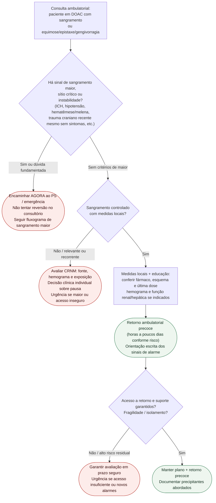

# Fluxograma: sinalizadores ambulatoriais de sangramento em DOAC

Prosa: [`sinalizadores-ambulatoriais-doac-sangramento-quando-encaminhar`](/biblioteca/sinalizadores-ambulatoriais-doac-sangramento-quando-encaminhar). Braço menor: [`sangramento-menor-doac-no-consultorio-conduta-ambulatorial`](/biblioteca/sangramento-menor-doac-no-consultorio-conduta-ambulatorial). Reversão aguda: [`fluxograma-sangramento-maior-em-anticoagulante-reversao-emergencial`](/biblioteca/fluxograma-sangramento-maior-em-anticoagulante-reversao-emergencial).

## Árvore de decisão

## Notas

Sangramento maior inclui sítio crítico, instabilidade, queda de Hb ≥2 g/dL ou transfusão ≥2 unidades. Nuisance controlado e CRNM não recebem a mesma decisão de continuidade. Trauma craniano em anticoagulado requer avaliação urgente mesmo sem sintomas; indicação de imagem segue NG232 e contexto clínico.

- **D1** = gate de segurança (EHRA 2021: tipo de sangramento).
- **D2** = controle local — se falha, não insistir no consultório.
- **D3** = logística/fragilidade muda o prazo do retorno.
- A árvore **não** decide antídoto, CCP, dose ou quantas tomadas pausar.
