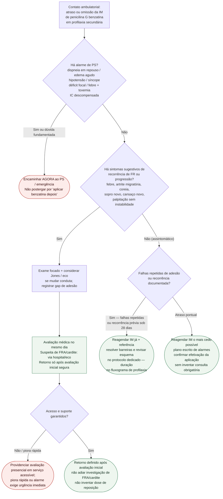

# Fluxograma ambulatorial: dose perdida de penicilina benzatina — destino

Prosa: [sinalizadores-ambulatoriais-profilaxia-benzatina-dose-perdida-quando-agir](/biblioteca/sinalizadores-ambulatoriais-profilaxia-benzatina-dose-perdida-quando-agir). Checklist: [checklist-ambulatorial-alarme-progressao-cardiopatia-reumatica](/biblioteca/checklist-ambulatorial-alarme-progressao-cardiopatia-reumatica). Duração/esquema: [fluxograma-profilaxia-secundaria-febre-reumatica-duracao-e-esquema](/biblioteca/fluxograma-profilaxia-secundaria-febre-reumatica-duracao-e-esquema).

## Árvore de decisão

## Notas

- **D1** = gate de segurança (descompensação / embolia / toxemia).
- **D2** = suspeita de recorrência ou progressão ambulatorial → destino clínico precoce (ponte a Jones / WHF, não a doses).
- **D3** = adesão e sistema (OMS 2024 + Ralph 2017); intervalo AHA 2009 só como ponte ao especialista.
- Não decide UI, mg, intervalo-padrão nem duração por idade/gravidade.

## Salvaguardas de adesão e diagnóstico

Atraso isolado assintomático não é emergência nem exige retorno artificial: garantir aplicação o mais cedo possível e resolver estoque, transporte, dor ou medo. Não dobrar dose, inventar reposição, reiniciar série ou encurtar intervalo; seguir prescrição e protocolo dedicado. Falhas repetidas pedem intervenção de adesão; recorrência documentada pede avaliação especializada.

Febre, artrite migratória, coreia e sopro novo abrem investigação pelos critérios de Jones e diferenciais, sem confirmar recorrência isoladamente. Instabilidade, IC, deterioração ou manifestações neurológicas graves exigem avaliação imediata. Profilaxia não depende de eco anual para continuar; indicação/duração seguem história de FR/cardite/RHD e diretriz específica.
