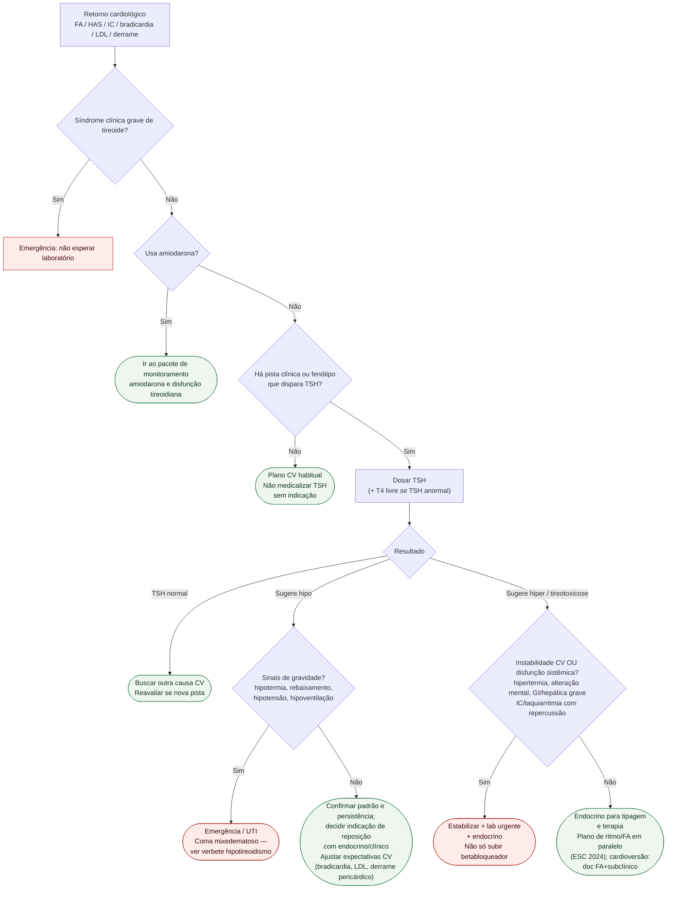

# Fluxograma ambulatorial: tireoide — quando pedir TSH e escalar

Prosa: [`sinalizadores-ambulatoriais-de-disfuncao-tireoidiana-no-retorno-cardiologico`](/biblioteca/sinalizadores-ambulatoriais-de-disfuncao-tireoidiana-no-retorno-cardiologico). Checklist: [`checklist-ambulatorial-tireoide-no-paciente-cardiologico`](/biblioteca/checklist-ambulatorial-tireoide-no-paciente-cardiologico). Amiodarona: [monitoramento clínico da amiodarona](/biblioteca/fluxograma-monitoramento-amiodarona-ambulatorial).

## Árvore de decisão

## Notas

- **D0**: amiodarona tem calendário e decisões próprios, após excluir emergência.
- **D1**: filtro de probabilidade (Klein/Danzi; Jabbar) — não TSH universal.
- **D2/D4**: ATA 2016 ancora tireotoxicose como causa tratável; ESC 2024 FA pede causa precipitante.
- Não decide dose de levotiroxina, tionamida, I-131 nem suspende GDMT automaticamente.

## Interpretar a síndrome, não o TSH isolado

TSH baixo com FA estável não é tempestade tireotóxica; esta exige tireotoxicose grave com disfunção sistêmica, incluindo hipertermia, alteração mental e manifestações GI/hepáticas/cardíacas. TSH alto isolado não é coma mixedematoso: suspeitar pela síndrome de hipotermia, alteração de consciência, hipoventilação, hipotensão/bradicardia grave em contexto apropriado. Não esperar laboratório para estabilizar suspeita clínica grave.

TSH normal não exclui hipotireoidismo central quando houver doença hipofisária ou suspeita clínica; nesse cenário, avaliar T4 livre. TSH anormal exige T4 livre; em TSH suprimido com T4 livre normal/inconclusivo, considerar T3 total. Doença sistêmica aguda e fármacos alteram exames; não iniciar tratamento crônico por resultado isolado sem contexto. Bradicardia, LDL alto e derrame pericárdico são inespecíficos. Repetir exames recentes se mudança clínica, gestação, amiodarona/lítio ou interferentes. FA segue seu algoritmo de ritmo/frequência e anticoagulação: não atrasar OAC indicada esperando eutireoidismo; cardioversão eletiva é individualizada.

[Disfunção tireoidiana por amiodarona](/biblioteca/disfuncao-tireoidiana-associada-a-amiodarona-diferenciar-tipo-1-de-tipo-2-e-decidir-sobre-suspender).
