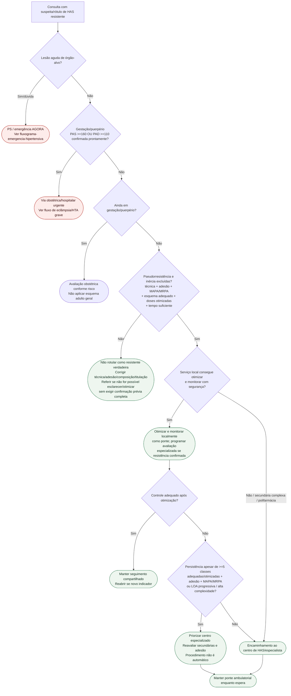

# Fluxograma: timing de encaminhamento ambulatorial na hipertensão resistente

Prosa: [timing-de-encaminhamento-ambulatorial-na-hipertensao-resistente](/biblioteca/timing-de-encaminhamento-ambulatorial-na-hipertensao-resistente) · [ponte-ambulatorial-enquanto-espera-centro-has-na-resistente](/biblioteca/ponte-ambulatorial-enquanto-espera-centro-has-na-resistente).

## Notas

- `MAPA/MRPA + adesão` **não bastam** se o esquema estiver subdosado/inadequado.
- Gestação/puerpério com PA grave segue regra própria antes do algoritmo de resistente.
- `>=5 classes` só é relevante quando composição, titulação, adesão e confirmação fora do consultório estão adequadas.
- Denervação/qualquer procedimento depende de avaliação especializada e não é consequência automática da refratariedade.

Na gestação/puerpério, mesmo abaixo do limiar grave, usar avaliação obstétrica própria; sintomas de pré-eclâmpsia ou deterioração requerem urgência. Não aplicar automaticamente fármacos do algoritmo adulto geral. A confirmação de resistência pode ser realizada no centro especializado quando faltarem recursos locais; a investigação não deve impedir encaminhamento necessário. Refratariedade exige composição adequada, usualmente incluindo diurético tiazídico de longa ação e antagonista mineralocorticoide quando tolerados/indicados; número de classes isolado não define o quadro.
Resistência confirmada é indicação de avaliação especializada; capacidade local de monitorar permite manter tratamento seguro enquanto se organiza essa avaliação, sem precisar esperar falha de cinco classes.
