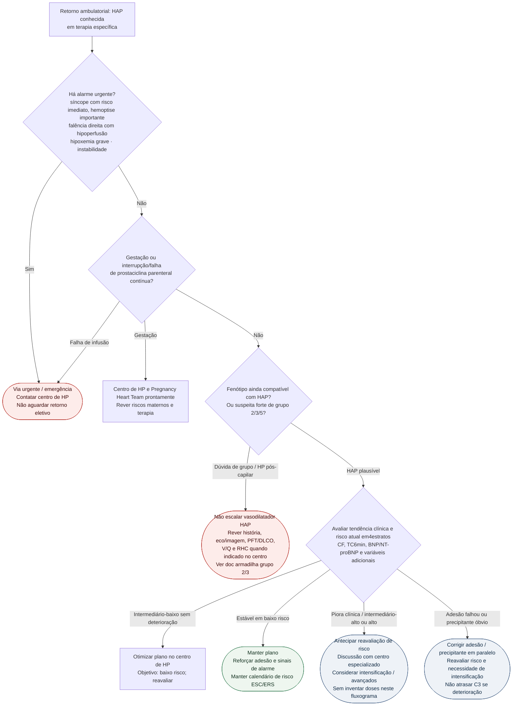

# Fluxograma ambulatorial: HAP — quando escalar ou referenciar

Prosa: [sinalizadores-ambulatoriais-de-piora-na-hap](/biblioteca/sinalizadores-ambulatoriais-de-piora-na-hap). Armadilha de fenótipo: [sinalizadores-ambulatoriais-nao-tratar-hp-grupo-2-3-como-hap](/biblioteca/sinalizadores-ambulatoriais-nao-tratar-hp-grupo-2-3-como-hap).

## Árvore de decisão

## Notas

- **D0** = gate de segurança ambulatorial (síncope e falência direita não são "ajuste de agenda").
- **D1** = evita iatrogenia: vasodilatador arterial pulmonar em HP do grupo 2 pode precipitar edema — detalhe no doc irmão e nos docs de grupo 2/3 do corpus ([sildenafila-na-hipertensao-pulmonar-do-grupo-2-o-ensaio-siovac](/biblioteca/sildenafila-na-hipertensao-pulmonar-do-grupo-2-o-ensaio-siovac), [hipertensao-pulmonar-do-grupo-3-dpoc-e-dpi-criterios-prognostico-e-risco-do-vasodilatador-especifico](/biblioteca/hipertensao-pulmonar-do-grupo-3-dpoc-e-dpi-criterios-prognostico-e-risco-do-vasodilatador-especifico)).
- **D2/C3** = lógica ESC/ERS 2022 de risco dinâmico e meta de baixo risco; a intensificação farmacológica ocorre no centro, não neste fluxograma.
- Não substitui [fluxograma-hap-estratificacao-risco-terapia-combinada-inicial](/biblioteca/fluxograma-hap-estratificacao-risco-terapia-combinada-inicial).

## Segurança e fenótipo

Hemoptise pequena autolimitada ou congestão estável exige contato rápido com o centro; hemoptise relevante, hipoxemia, hipotensão, hipoperfusão ou deterioração rápida exige emergência. Falha/interrupção de prostaciclina parenteral contínua é emergência potencial por rebote; não improvisar suspensão ou transição. Gestação estável pede manejo especializado imediato, sem PS automático; deterioração impõe urgência.

Não escalar empiricamente fármacos de HAP em HP por doença esquerda; tratar a causa e discutir CpcPH complexo no centro. PH-ILD selecionada pode ter indicação específica, inclusive treprostinil inalado; grupo 3 não é proibição absoluta de toda terapia. Edema após vasodilatador também levanta PVOD/PCH. Na HP suspeita/nova, manter V/Q visível para excluir doença tromboembólica, mesmo com pistas de grupo 2/3; completar função pulmonar/DLCO, imagem e hemodinâmica conforme necessidade.
