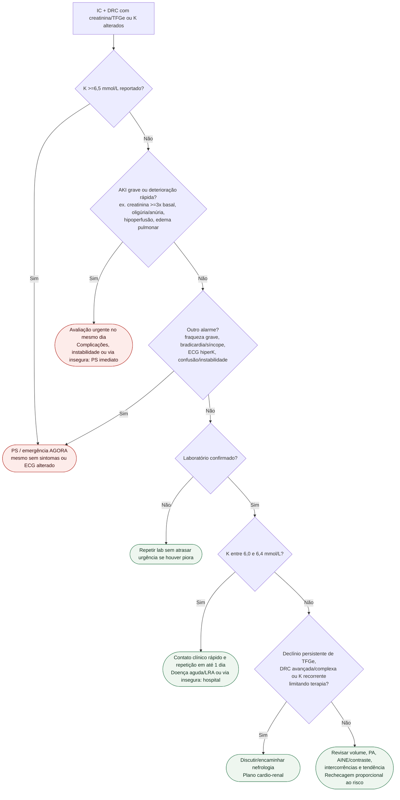

# Fluxograma ambulatorial: creatinina e potássio na IC com DRC

## Notas
- K 6,0–6,4 mmol/L: contato clínico rápido e repetição em até 1 dia; doença aguda/LRA ou falta de via segura exige avaliação hospitalar.
- Resultado grave com possível hemólise: confirmação em paralelo, sem atrasar avaliação urgente. Um ECG normal não exclui risco por hiperpotassemia.
- **K >=6,5 mmol/L** não depende de sintoma/ECG para destino emergencial.
- AKI pode ser grave mesmo sem oligúria.
- Creatinina subindo geralmente acompanha **TFGe caindo**, não subindo.
- Não fornece doses nem manda interromper GDMT automaticamente.

## Conteúdo relacionado
- [Hiperpotassemia grave: segurança](/biblioteca/hipercalemia-na-uco-gravidade-ecg-e-gates-de-seguranca).
- [LRA: critérios KDIGO](/biblioteca/lesao-renal-aguda-na-uco-criterios-kdigo-creatinina-e-diurese).
