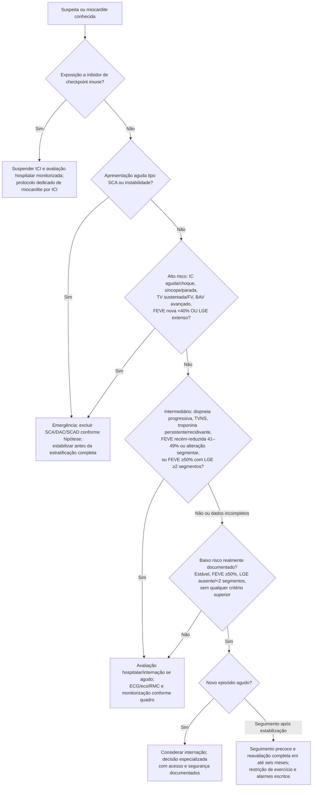

# Fluxograma ambulatorial: miocardite — risco e destino

Prosa: [sinalizadores-ambulatoriais-miocardite-quando-encaminhar](/biblioteca/sinalizadores-ambulatoriais-miocardite-quando-encaminhar). Checklist: [miocardite-checklist-ambulatorial-de-alarme](/biblioteca/miocardite-checklist-ambulatorial-de-alarme). Diagnóstico/EMB: [miocardite-diagnostico-estratificacao-de-risco-e-biopsia-endomiocardica-esc-2025](/biblioteca/miocardite-diagnostico-estratificacao-de-risco-e-biopsia-endomiocardica-esc-2025).

## Árvore de decisão

## Etapas obrigatórias antes de concluir baixo risco

Suspeita de SCA requer investigação coronária conforme probabilidade; troponina não confirma miocardite isoladamente. Se exposição a ICI, usar imediatamente [via específica](/biblioteca/miocardite-por-inibidor-de-checkpoint-imune-emergencia-esc-2025), com suspensão do ICI e avaliação hospitalar monitorizada. RMC integra confirmação e estratificação quando apropriada; dados incompletos não equivalem a baixo risco.

Na suspeita aguda intermediária, priorizar avaliação hospitalar/internação; casos baixos também exigem considerar internação. Seguimento ambulatorial pressupõe estabilidade e via estruturada. FEVE exatamente 40% não está explicitada no corte da tabela citada: não classificá-la como baixo risco; resolver pelo quadro completo e avaliação especializada. LGE extenso é critério alto independente, sem inventar número de segmentos. EMB exige decisão especializada por apresentação/etiologia e impacto terapêutico, não automatismo por um achado.

Após miocardite confirmada, planejar reavaliação clínica, biomarcadores, ECG, eco, Holter, RMC e teste de esforço quando clinicamente seguro, dentro de seis meses. Restringir exercício até remissão e por pelo menos um mês, com retorno individualizado no protocolo próprio; não realizar teste na fase ativa apenas para cumprir calendário.
