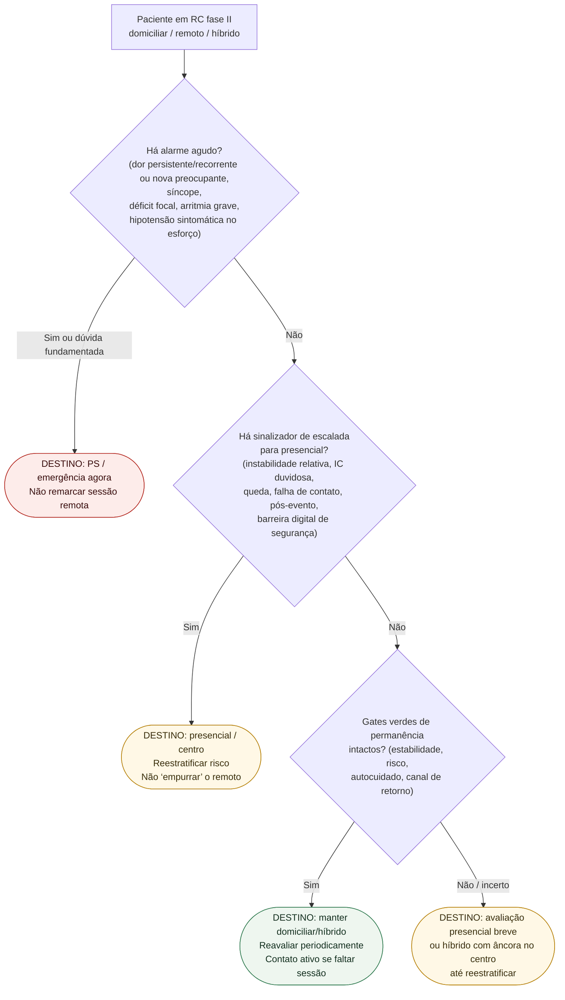

# Fluxograma: destino do modelo de entrega na reabilitação cardíaca ambulatorial

Prosa: [reabilitacao-cardiaca-domiciliar-ou-hibrida-quando-escalar-para-presencial](/biblioteca/reabilitacao-cardiaca-domiciliar-ou-hibrida-quando-escalar-para-presencial). Sintomas na sessão: [esc-2026-reabilitacao-cardiaca-sintese-pratica-corvia](/biblioteca/esc-2026-reabilitacao-cardiaca-sintese-pratica-corvia).

## Árvore de decisão

## Notas

- **D1** = gate de segurança (sintomas e sinais de instabilidade).
- **D2** = escalada de **modelo**, não de intensidade numérica.
- **D3** = permanência só com estabilidade documentável (Thomas2019 / ESC2021).
- Não decide METs, %FC máxima nem doses de fármacos.

## Segurança clínica e ocupacional

Interromper a sessão quando ocorrer sintoma preocupante. Dor persistente, recorrente, em repouso ou acompanhada de instabilidade exige emergência. Angina de esforço conhecida que resolve prontamente não implica PS automático, mas exige revisão do plano antes de retomar exercício; sintomas novos requerem avaliação presencial breve, com urgência conforme contexto.

Direção profissional, aviação, máquinas perigosas e trabalho em altura exigem avaliação de medicina do trabalho e critérios regulatórios específicos, incluindo incapacitação súbita, espera após eventos e restrições de dispositivos. Compatibilidade funcional isolada não libera essas funções. Barreiras de compreensão exigem suporte/educação acessível, não exclusão automática do programa ou do trabalho.
