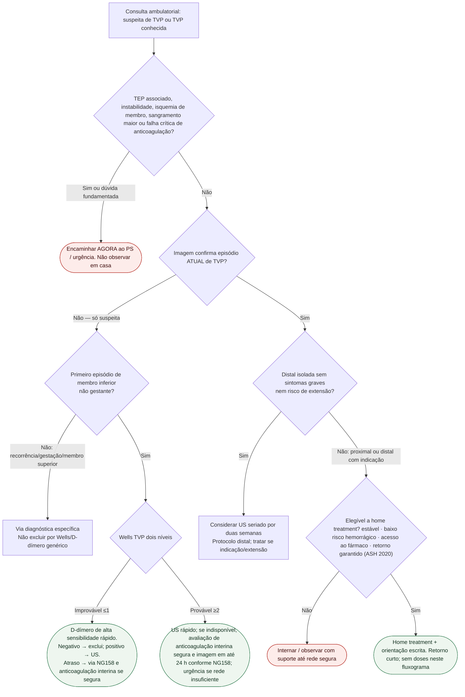

# Fluxograma: sinalizadores ambulatoriais na TVP — destino

Prosa: [`sinalizadores-ambulatoriais-tvp-quando-escalar-urgencia`](/biblioteca/sinalizadores-ambulatoriais-tvp-quando-escalar-urgencia) · [`tvp-confirmada-no-consultorio-ambulatorial-versus-internacao`](/biblioteca/tvp-confirmada-no-consultorio-ambulatorial-versus-internacao).

Diagnóstico (Wells/D-dímero/US): [`fluxograma-trombose-venosa-profunda-suspeita-wells-d-dimero-e-ultrassom`](/biblioteca/fluxograma-trombose-venosa-profunda-suspeita-wells-d-dimero-e-ultrassom). Pós-TEP: [Sinalizadores após TEP](/biblioteca/sinalizadores-ambulatoriais-pos-tep-quando-reencaminhar-urgencia).

## Árvore de decisão

## Notas

- **D1** = gate de segurança.
- **D3** = só aponta o caminho; o detalhe do algoritmo está no fluxograma Wells/US.
- **D4** = elegibilidade ASH 2020 — ver protocolo irmão de TVP confirmada.
- **Não decide** doses, escolha DOAC vs HBPM nem duração após 3–6 meses.

## Condições para plano domiciliar

Confirmar episódio atual e localização. Distal isolada de baixo risco pode seguir US seriado em vez de anticoagulação; proximal e distal com indicação precisam tratamento oportuno, sem aguardar consulta vascular. Avaliar dor, comorbidades, rim/fígado, gestação, câncer, risco hemorrágico, acesso ao fármaco, adesão e suporte. Phlegmasia, ameaça de membro ou TEP exigem urgência. Sangramento segue [classificação maior/CRNM/nuisance](/biblioteca/sinalizadores-ambulatoriais-doac-sangramento-quando-encaminhar).
