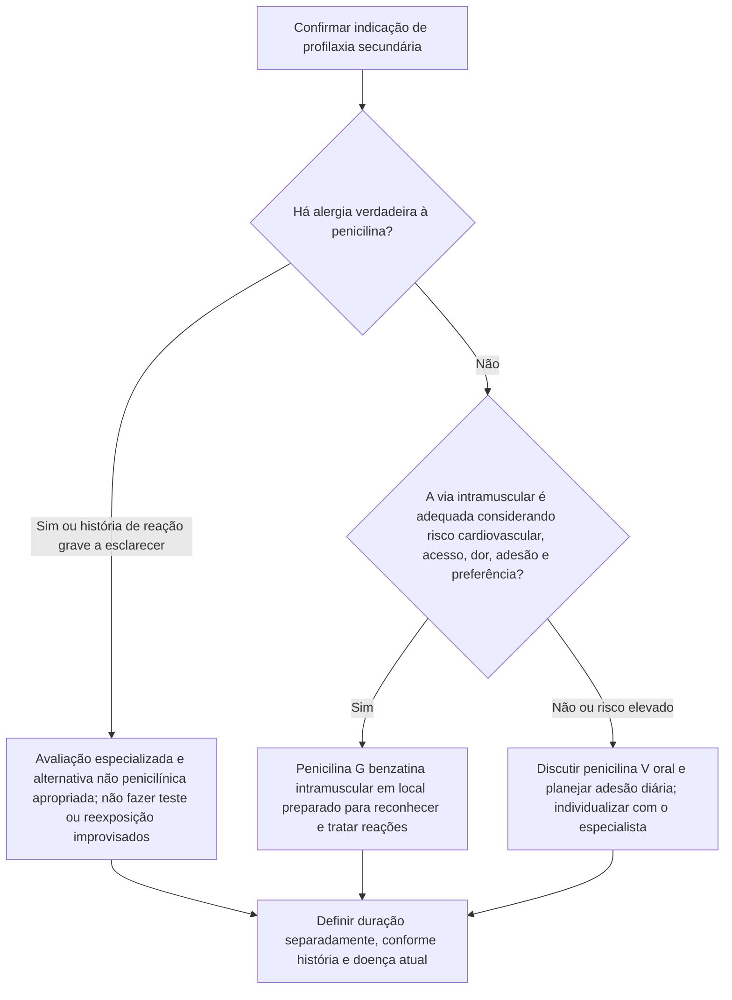
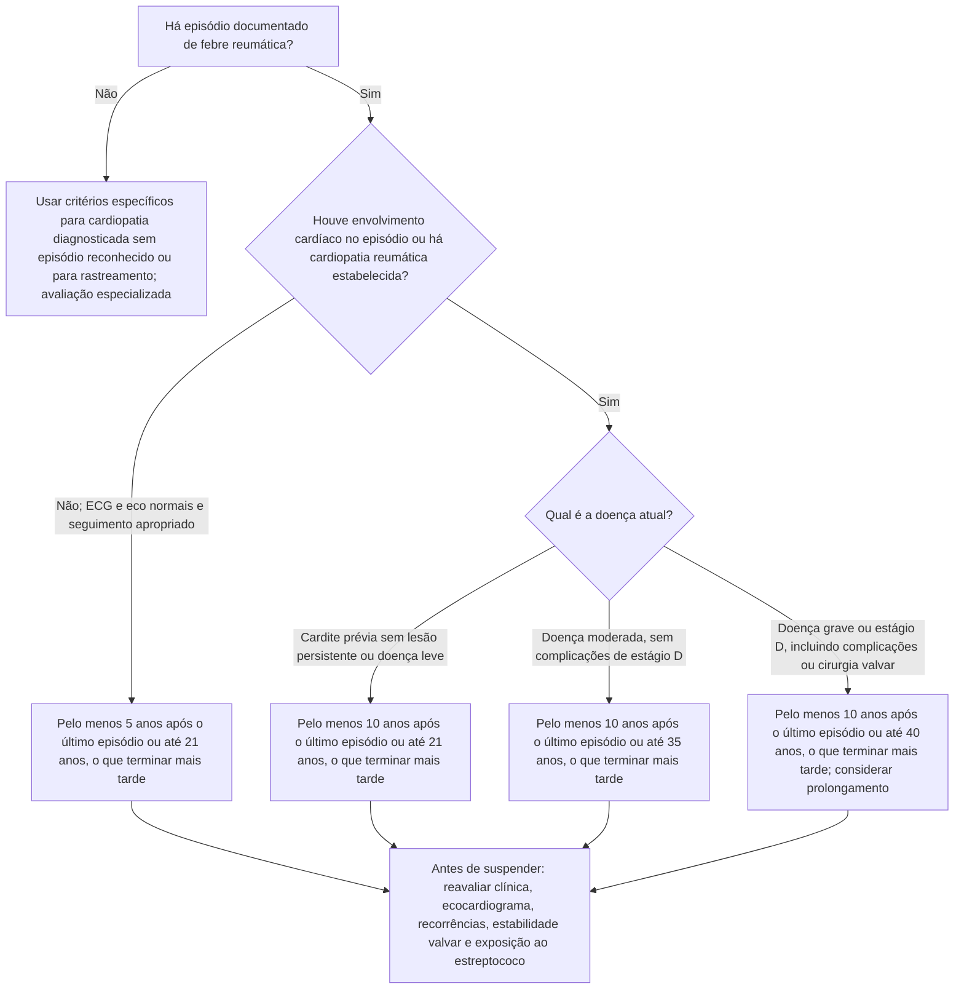

# Fluxograma: profilaxia secundária da febre reumática — esquema e duração

Organizar a profilaxia exige duas decisões: **qual esquema o paciente pode manter com segurança** e **por quanto tempo**. O fluxo utiliza a diretriz australiana de agosto de 2025, com a recomendação da OMS de 2024 sobre a alternativa oral. Conciliar a aplicação no Brasil com o protocolo assistencial local.

## 1. Escolher fármaco e via

Na referência australiana, a benzatina é aplicada em **1.200.000 UI para peso ≥20 kg** ou **600.000 UI para <20 kg**, por via intramuscular profunda, habitualmente a cada **28 dias**. A dose e a técnica em crianças muito pequenas precisam de planejamento pediátrico. O esquema pode ser de **21 dias** em recorrência apesar de adesão completa ao de 28 dias ou quando o impacto de uma recorrência seria especialmente grave. A diretriz brasileira de 2009 utiliza **21 dias**; documentar o protocolo adotado.

Quando escolhida a alternativa oral, a tabela australiana apresenta penicilina V **250 mg a cada 12 horas**; em alergia grave confirmada, apresenta eritromicina **250 mg a cada 12 horas**. Não misturar automaticamente alternativas de diferentes diretrizes: confirmar faixa etária, alergia, interações e protocolo local. A via oral não elimina a necessidade de adesão nem muda sozinha a duração.

## 2. Definir o marco de reavaliação

Este segundo fluxo se aplica a **episódio documentado de febre reumática**. A classificação considera ECG, ecocardiograma e evolução clínica, não apenas a descrição antiga da intensidade da cardite.

Um episódio aos 25 anos, com ECG e ecocardiograma normais durante a doença e seguimento apropriado, não permite suspender imediatamente por já ter ultrapassado 21 anos: na referência utilizada, ainda é necessário cumprir o prazo mínimo de cinco anos. Havendo envolvimento cardíaco, essa regra muda. A data calculada nunca dispensa a reavaliação antes da suspensão.

## Pontos que mudam a decisão

**Doença grave não impõe a via intramuscular.** A AHA de 2022 e a OMS de 2024 orientam considerar a alternativa oral em pacientes selecionados com risco cardiovascular elevado. Essa escolha ocorre antes do ramo de duração; não é uma exceção escondida após a prescrição.

**Ausência de rash não exclui anafilaxia.** Se ocorrer reação com suspeita de anafilaxia, adrenalina intramuscular deve ser administrada prontamente, inclusive em valvopatia grave. A possibilidade de colapso vasovagal ou cardiovascular não justifica esperar por manifestações cutâneas.

**Erradicação aguda e profilaxia são indicações diferentes.** Não transportar automaticamente dose, faixa de peso ou duração de uma para a outra. O esquema preventivo é repetido pelo prazo definido; não se resume à dose usada durante o episódio agudo.

**Há situações fora desta árvore.** Diagnóstico possível/provável, alterações de rastreamento e cardiopatia sem história reconhecida de febre reumática têm critérios próprios. Cirurgia não elimina automaticamente a profilaxia; em doença avançada, a duração pode ser prolongada conforme risco e estabilidade.

## Tudo com Tudo

- [Profilaxia secundária: duração por categoria de risco](/biblioteca/profilaxia-secundaria-antibiotica-na-febre-reumatica-duracao-por-categoria-de-risco) — fundamentos e limites dos prazos.
- [Segurança da penicilina benzatina](/biblioteca/seguranca-da-penicilina-benzatina-na-cardiopatia-reumatica-grave-alergia-vasovagal-ou-comprometimento-cardiovascular) — seleção da via e avaliação do risco.
- [Reação aguda: diferenciação e conduta](/biblioteca/fluxograma-reacao-aguda-a-penicilina-benzatina-na-cardiopatia-reumatica-diferenciacao-e-conduta) — conduta diante de instabilidade após a aplicação.
