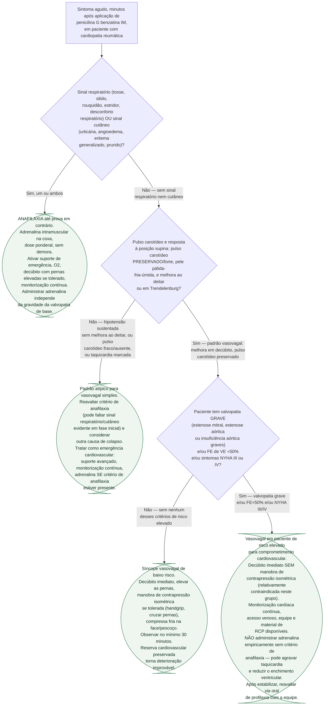

# Fluxograma: Reação Aguda à Penicilina Benzatina na Cardiopatia Reumática — Diferenciação e Conduta

Pergunta desta árvore: **diante de um sintoma agudo, em minutos, após a aplicação de penicilina benzatina intramuscular em paciente com cardiopatia reumática, o quadro é anafilaxia, resposta vasovagal em paciente de baixo risco, ou resposta vasovagal em paciente sem reserva cardiovascular — e a conduta muda entre esses três cenários, inclusive quanto a administrar adrenalina.** Este fluxograma cobre o momento da reação em si; a escolha prévia de fármaco/via e duração da profilaxia está no [fluxograma de esquema por gravidade](/biblioteca/fluxograma-profilaxia-secundaria-febre-reumatica-duracao-e-esquema), já publicado nesta pasta. Folhas verdes são condutas. Um pai por nó. Sem ciclo. Folhas em estádio.

## Árvore de decisão

## Como ler cada folha

**C1 — anafilaxia até prova em contrário.** Sinal respiratório ou cutâneo, isolado ou combinado, é suficiente para tratar como anafilaxia e administrar adrenalina intramuscular sem demora. O advisório da AHA é explícito: a anafilaxia confirmada exige adrenalina **independentemente** da gravidade da valvopatia de base — o risco de não tratar anafilaxia supera o risco teórico do fármaco nesse cenário específico.

**C2 — padrão atípico, a folha que existe para não forçar uma resposta binária.** Hipotensão que não melhora em decúbito, ou pulso carotídeo fraco, ou taquicardia marcada, sem sinal respiratório/cutâneo evidente, não se encaixa perfeitamente nem no padrão vasovagal típico nem na apresentação clássica de anafilaxia. O próprio *advisory* descreve resposta inconsistente ao tratamento padrão de anafilaxia em vários casos graves relatados — por isso esta folha não descarta anafilaxia, reforça reavaliação e trata como emergência cardiovascular com adrenalina condicionada ao critério clínico, não automática.

**C3 — vasovagal de baixo risco.** Melhora em decúbito e pulso carotídeo preservado, em paciente sem valvopatia grave, disfunção sistólica relevante ou sintomas avançados de insuficiência cardíaca. Neste grupo, as manobras de contrapressão isométrica são apropriadas e têm respaldo em estudos de síncope vasovagal em outros contextos (doação de sangue, vacinação).

**C4 — vasovagal em paciente sem reserva cardiovascular, a folha mais delicada da árvore.** O padrão clínico inicial ainda é vasovagal (pulso carotídeo preservado, melhora relativa em decúbito), mas o paciente pertence ao grupo de risco elevado da estratificação do *advisory* — por isso a resposta correta não é reflexa: **evitar contrapressão isométrica** (pode ser contraindicada em estenose valvar crítica e insuficiência cardíaca) e **não administrar adrenalina empiricamente** fora de critério de anafilaxia, porque a taquicardia induzida pela adrenalina reduz o tempo de enchimento ventricular exatamente no paciente que mais depende dele (estenose mitral grave, em particular). A conduta é monitorização, suporte e, depois de estabilizado, reavaliação da via de profilaxia.

## O que a árvore não mostra

**Dose e protocolo de RCP/adrenalina não estão especificados aqui.** Esta árvore orienta reconhecimento e primeira conduta; a execução técnica (dose ponderal de adrenalina, protocolo de suporte avançado) segue o protocolo de emergência do próprio serviço, com equipe treinada — **VERIFICAÇÃO HUMANA NECESSÁRIA** quanto à adequação a cada contexto assistencial.

**A estratificação de risco (D3) deveria, idealmente, já ter acontecido antes da aplicação**, não apenas ser descoberta durante uma reação aguda — ver o [documento de segurança da profilaxia](/biblioteca/seguranca-da-penicilina-benzatina-na-cardiopatia-reumatica-grave-alergia-vasovagal-ou-comprometimento-cardiovascular) e o [fluxograma de escolha de esquema por gravidade](/biblioteca/fluxograma-profilaxia-secundaria-febre-reumatica-duracao-e-esquema), que tratam da decisão pré-injeção entre via intramuscular e oral.

**Sintomas gastrointestinais isolados (náusea, vômito) não discriminam entre os dois quadros** e, por isso, não formam um ramo próprio nesta árvore — a fonte é explícita quanto a essa limitação.

**Diagnósticos alternativos raros** (por exemplo, síndrome de Kounis — vasoespasmo coronariano mediado por reação de hipersensibilidade) podem se sobrepor ao quadro de C2 e não têm ramo dedicado nesta árvore, que se limita à diferenciação proposta pelo advisório da AHA.

## Tudo com Tudo

- [Segurança da Penicilina Benzatina na Cardiopatia Reumática Grave: Diferenciando Reação Alérgica, Resposta Vasovagal e Comprometimento Cardiovascular](/biblioteca/seguranca-da-penicilina-benzatina-na-cardiopatia-reumatica-grave-alergia-vasovagal-ou-comprometimento-cardiovascular) — Síntese clínica completa da qual esta árvore deriva, com a tabela de diferenciação e a estratificação de risco na íntegra.
- [Fluxograma: Profilaxia secundária da febre reumática — escolha do antibiótico e duração por gravidade](/biblioteca/fluxograma-profilaxia-secundaria-febre-reumatica-duracao-e-esquema) — Decisão pré-injeção entre via intramuscular e oral, que D3 nesta árvore pressupõe já ter sido considerada.
- [Fluxograma: síncope reflexa versus cardíaca — diagnóstico diferencial](/biblioteca/fluxograma-sincope-reflexa-versus-cardiaca-diagnostico-diferencial) — Mesma lógica de diferenciação por pulso e resposta postural, aplicada a síncope fora do contexto de injeção.
- [Síndrome de Kounis: síndrome coronariana aguda alérgica](/biblioteca/sindrome-de-kounis-sindrome-coronariana-aguda-alergica) — Diagnóstico diferencial a considerar na folha C2, quando o padrão não se encaixa integralmente em vasovagal nem em anafilaxia clássica.
- [Epinefrina (adrenalina)](/biblioteca/epinefrina-adrenalina) — Fármaco de C1; a folha C4 explica por que a mesma conduta pode ser prejudicial fora do critério de anafilaxia.
